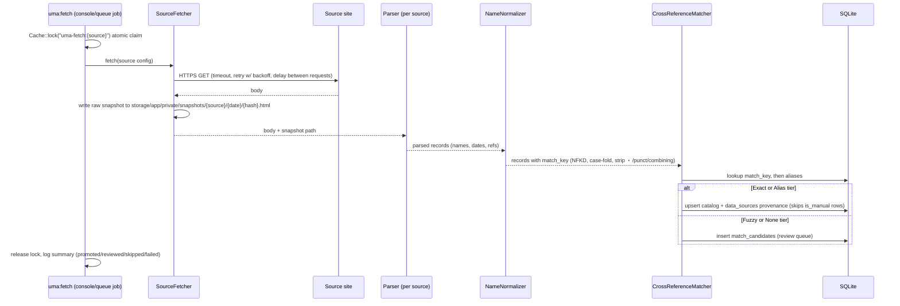

# ARCHITECTURE.md

Revision 0.2: sections changed by the fourth legacy repository (`uma_musume_race_planner`) are marked [rev 0.2 — repo #4]; everything else is unchanged from revision 0.1.

Consolidated Umamusume Trainer companion. Local-only Laravel 13 tool. Condensed version for agent context: `ARCHITECTURE-ESSENTIALS.md`. Decisions that cut legacy features: `PRD.md` §6 and `docs/PRE-MORTEM.md` (§4 for repo #4).

## 1. Tech Stack (version pins)

Pinned from `composer show --direct` and `package.json` as installed in this repository (2026-09-27). Per the foundation rules, APIs must match these installed versions; do not assume.

| Layer | Package | Version | Notes |
|---|---|---|---|
| Runtime | PHP | 8.5.8 | `declare(strict_types=1)` everywhere; 8.4+ features allowed (readonly, promoted props, `#[Override]`). |
| Framework | laravel/framework | 13.32.0 | Laravel 13. |
| Database | SQLite | bundled with PHP (pdo_sqlite) | Only supported driver. WAL mode, `busy_timeout` (see §3). |
| Cache/Queue | `database` stores | framework built-in | No Redis. Queue worker runs via `composer run dev`. |
| Testing | pestphp/pest | 4.7.8 | + pest-plugin-laravel 4.1.0. Feature tests by default. |
| Static analysis | larastan/larastan | 3.12.1 | Level 6 baseline, `phpstan.neon` already configured. |
| Formatting | laravel/pint | 1.32.1 | `pint.json` (laravel preset). |
| Frontend CSS | tailwindcss | ^4.0.0 | CSS-first config: theme lives in `resources/css/app.css` `@theme` block. There is deliberately no `tailwind.config.js`; Tailwind v4 ignores one unless loaded via `@config`. |
| Bundler | vite + laravel-vite-plugin | ^7.0.7 / ^2.0.0 | `@tailwindcss/vite` plugin. |
| HTTP (client side) | axios | ^1.11.0 | Only if JS needs it; Blade-first. |
| HTTP (server side) | `Http` facade | framework built-in | Fetch engine only. Timeouts, retries, rate limiting per §6. Ref: https://laravel.com/docs/13.x/http-client |

Not installed, not to be added without approval: sanctum, breeze, maatwebsite/excel, any SPA framework.

## 2. System Design

```mermaid
flowchart LR
    subgraph Local["Trainer's machine (local-only)"]
        subgraph Web["Web (Blade + Tailwind v4)"]
            UI[Catalog / Runs / Review UI]
        end
        subgraph API["/api/v1 (P2, read-only)"]
            RES[API Resources]
        end
        CMD[artisan uma:fetch / uma:review / uma:backup]
        WORKER[queue worker (database driver)]
        subgraph Engine["Data-fetching engine (app/Services/DataPipeline)"]
            FETCH[SourceFetcher] --> SNAP[(storage/app/private/snapshots)]
            FETCH --> PARSE[Source parser (per source)]
            PARSE --> NORM[NameNormalizer (NFKD)]
            NORM --> MATCH[CrossReferenceMatcher]
            MATCH -->|Exact / Alias| PROMOTE[Promote: upsert catalog]
            MATCH -->|Fuzzy / None| REVIEW[(match_candidates review queue)]
        end
        DB[(SQLite: WAL mode)]
    end
    SRC1[JP source sites] -->|HTTPS, throttled| FETCH
    SRC2[Global source sites] -->|HTTPS, throttled| FETCH
    UI --> DB
    RES --> DB
    CMD --> Engine
    WORKER --> Engine
    PROMOTE --> DB
    REVIEW --> DB
```

Trust boundaries (security-and-hardening §threat model): (1) fetched web content, untrusted, enters only through `SourceFetcher` + parser; (2) Trainer's browser input, validated by Form Requests; (3) everything inside `app/` after those boundaries is trusted. There is no authentication boundary because there is no auth surface (§8).

## 3. Database Schema & Eloquent Models

SQLite only. Migrations use anonymous classes (Laravel 13 default). All multi-row writes inside `DB::transaction`. Connection configured with `journal_mode=WAL` and `busy_timeout` via `PRAGMA` in the `sqlite` connection options so the web process and queue worker coexist. Ref: https://laravel.com/docs/13.x/database#configuration

Naming: `Umamusume` is the exclusive term for characters (singular and plural identical). Tables are snake_case plurals of models, with one deliberate exception: the characters table is `umamusume` (invariant plural), matching the race name.

### Catalog domain

```
umamusume                     (the character catalog)
  id                bigint PK
  slug              string unique          (url-safe, from English name)
  name              string                 (Global English display name)
  name_ja           string nullable        (Japanese display name)
  match_key         string nullable index  (NFKD-normalized, case-folded, punctuation stripped; engine-owned unless is_manual)
  release_status    string enum-backed     (ReleaseStatus: GlobalReleased | GlobalAnnounced | JapanOnly)
  jp_debut_date     date nullable
  global_debut_date date nullable
  is_manual         bool default false     (human-edited: engine must never overwrite)
  external_ref      string nullable index  (the source's own character id, `gametora:char:{id}`; the link costume cards attach through. ADR-0008)
  timestamps

umamusume_aliases
  id, umamusume_id FK->umamusume cascade, alias string, language string enum-backed (AliasLanguage: Japanese | English | Romanized)
  unique(alias, language)

character_cards               (costume cards that reached [Global]; ADR-0008. Migrated as 2026_09_29_120100; empty until the card fetch lands)
  id, card_id unsigned int unique (the source's own card id, not this table's PK; a re-fetch is idempotent by identity, FR-B-5)
  umamusume_id FK->umamusume cascade
  title string            (verbatim [Global] client string, brackets included; source data, never normalized copy)
  rarity unsigned tinyint enum-backed (CardRarity: OneStar | TwoStar | ThreeStar)
  global_release_date date (required: a card with no Global date is not a row here)
  is_debut_form bool default false (derived: earliest JP release among that trainee's cards; the export has no debut field to copy)
  unconfirmed bool default false (Tier B stands alone behind it: stored flagged, hidden by default)
  source_url string          (not null: ADR-0003 Amendment R3 puts provenance on the reference row itself)
  snapshot_path string nullable
  fetched_at timestamp nullable
  source_timezone string nullable (IANA, e.g. Asia/Tokyo)
  is_manual bool default false (human-edited at card grain: fixing one card's title claims that card, not the whole trainee)
  timestamps

skills
  id, name string, name_ja string nullable, match_key string nullable index,
  sp_cost int nullable, type string nullable, is_unique bool default false, timestamps

data_sources                  (provenance, one row per fact-fetch)
  id, umamusume_id FK->umamusume cascade,
  url string, source_key string (config('uma.sources') key),
  fetched_at datetime, snapshot_path string nullable,
  confidence float nullable, source_timezone string nullable (IANA, e.g. Asia/Tokyo)

match_candidates              (review queue for Fuzzy/None matches)
  id, source_key, external_ref string nullable,
  proposed_name string, proposed_name_ja string nullable, proposed_match_key string nullable,
  suggested_umamusume_id FK->umamusume nullable (the fuzzy proposal),
  match_tier string enum-backed (MatchTier: Fuzzy | None),
  status string enum-backed (CandidateStatus: Pending | Confirmed | Aliased | Rejected),
  payload json (full parsed record), created_by_fetch_at datetime, timestamps
```

`character_cards` and `umamusume.external_ref` are authorized by
`docs/adr/0008-character-card-catalog-layer.md` and **are applied**: they landed with
`2026_09_29_120000_add_external_ref_to_umamusume_table` and
`2026_09_29_120100_create_character_cards_table` in the roster slice, together with
`App\Models\CharacterCard`, `App\Enums\CardRarity`, `CharacterCardFactory` and `Umamusume::cards()`.
`PromoteMatchedRecord` writes `external_ref` on both of its paths from this change onward, which is
what makes the source link durable; the card table stays empty until the card parser and its declared
source land, and `training_runs.character_card_id` has since landed as `2026_09_29_120200`, with
`TrainingRun::characterCard()` and a same-trainee `exists` rule on `StoreTrainingRunRequest`. A card
row's provenance **is** inline:
`source_url`, `snapshot_path`, `fetched_at`, `source_timezone` and the card's own `is_manual` sit on the
card, which is what `ADR-0003` Amendment R3 requires of a reference row and what `scenario_races`,
`scenario_slots` and `race_catalog_slots` each already do, while `scenarios` carries `source_url` and
`fetched_at` inline per `ADR-0004:49-51` plus its own `is_manual`. `data_sources` keeps its own meaning: it is
`umamusume_id`-scoped, the table behind FR-A-4 and the detail page's Provenance section, a trainee's fetch
history rather than a card's.

### Trainer-data domain

```
training_runs
  id, umamusume_id FK->umamusume, scenario string nullable,
  character_card_id FK->character_cards nullable (ADR-0008: the form the run started on; umamusume_id
    stays the required owner. Migrated as 2026_09_29_120200_add_character_card_id_to_training_runs_table,
    with TrainingRun::characterCard() and the same-trainee exists rule on StoreTrainingRunRequest)
  status string enum-backed (RunStatus: Active | Completed | Retired) default Active,
  inheritance_parent_a_id FK->umamusume nullable, inheritance_parent_b_id FK->umamusume nullable,
  legacy_selection json nullable (ADR-0010: the Legacy Select read-back as the Trainer recorded it;
    see App\Models\Legacy\LegacySelectionPayload for the shape and what it deliberately omits),
  notes text nullable, timestamps

turn_entries
  id, training_run_id FK->training_runs cascade, turn unsigned int,
  speed, stamina, power, guts, wit unsigned smallint,
  sp unsigned smallint nullable, condition string nullable
  unique(training_run_id, turn)
  -- stats validated 0..1200, turn >= 1 (StoreTurnEntryRequest) [rev 0.2 — repo #4]

run_skills                    (pivot with payload)
  training_run_id FK cascade, skill_id FK,
  status string enum-backed (SkillAcquisition: Suggested | Acquired | Skipped),
  turn_acquired unsigned int nullable
  PK(training_run_id, skill_id)
  -- Suggested = planned pre-run; Acquired/Skipped = outcome [rev 0.2 — repo #4]
```

Planner-domain boundary [rev 0.2 — repo #4]: repo #4's career-run planner maps onto `training_runs` + `turn_entries` + `run_skills`. Its race-day snapshots, manual race predictions, dual localStorage/account storage, image uploads, and DB-level enum columns are cut (Pre-Mortem §4.1); no new tables are introduced for the planner. Growth-rate/aptitude/base-stat reference data (repo #4 hardcodes it in seeders) is deferred to PRD OQ-4; no columns added now, so no speculative planner subsystem enters the schema.

Framework defaults (`users`, `cache`, `jobs`) remain untouched; `users` is unused by design (no auth).

### Support-card entities: proposed, not built

No support-card table exists, and `PRD.md` §6.9 lists a support-card database as a Phase 1 non-goal.
The entity shapes that a 2026-09-27 brief asked for are specified in `docs/adr/0005-support-card-entities.md`
with the evidence that corrects them, and they are **not** part of this design until the owner settles
the scope question there. Read that ADR before adding any `support_cards`, `user_support_cards` or
`deck_slots` migration, model, factory or route: the game mechanics they would describe are documented
and settled (`docs/UMAMUSUME_REFERENCE.md` §1.4.7), the schema is not, and an entity copied out of the
ADR into a migration would silently reverse §6.9.

**The two card words are not the same thing, and only one of them is authorized here.** `character_cards`
(`docs/adr/0008-character-card-catalog-layer.md`, owner ruling 2026-09-29) is the **costume-card** table:
the outfits a trainee can appear in, one row per card that reached `[Global]`. It authorizes nothing in
the support-card direction. `support_cards`, `user_support_cards` and `deck_slots` stay forbidden by
`PRD.md` §6.9, `ADR-0005` stays **DECLINED** (owner ruling R37, 2026-09-28), and no slice may cite
`ADR-0008` as permission for any of them. `training_runs.character_card_id` names a costume, not a deck
slot; neither ADR authorizes the other.

### Eloquent conventions (laravel-best-practices)

- `#[Fillable]` / `#[Hidden]` attributes, not legacy properties.
- `casts()` as a method; enums cast by class name; dates cast `date`.
- `HasFactory` on every model + factory under `database/factories/`.
- Relationships eager-loaded with `with`/`loadMissing` at call sites that render lists (catalog index loads aliases count only; run show loads `umamusume`, `turnEntries`, `runSkills.skill`).
- No soft deletes anywhere (domain rules); deletion of Trainer data is explicit and cascades from the run.

## 4. API Structure (REST, versioned, typed)

Web UI is Blade (server-rendered). The JSON API is a read-only P2 surface for the Trainer's own scripts. Conventions per `api-and-interface-design`: plural nouns, no verbs; camelCase query params and response fields; one error shape; offset pagination on all lists; additive evolution only. Ref: https://laravel.com/docs/13.x/eloquent-resources

```
GET /api/v1/umamusume?status=&search=&page=&pageSize=   -> { data: [Umamusume], pagination: { page, pageSize, totalItems, totalPages } }
GET /api/v1/umamusume/{slug}                            -> { data: Umamusume } (includes aliases, sources)
GET /api/v1/training-runs?page=                         -> { data: [TrainingRunSummary], pagination }
GET /api/v1/training-runs/{id}                          -> { data: TrainingRun } (includes turns, skills)
```

Error shape (every non-2xx):

```json
{ "error": { "code": "NOT_FOUND", "message": "No umamusume with slug 'x'." } }
```

Status mapping: 400 bad input, 404 missing, 422 validation, 500 internal (generic message, details to log only). Type contracts are expressed as API Resource classes (`app/Http/Resources/`) with PHPDoc array-shapes; no schema-generation tooling (cut in Pre-Mortem §1).

Deliberately absent: auth endpoints, write endpoints, idempotency keys (single local consumer, read-only surface), cursor pagination.

## 5. Data-Fetching Engine (JP ↔ Global cross-reference)

### Pipeline stages



### Design decisions

- **Search-based cross-reference:** a source parser may resolve a JP record to Global data by issuing a scoped web search (source declared in config, query template per source). Search results are treated exactly like fetched pages: untrusted, snapshotted, parsed, matched. The engine never invents a mapping it cannot cite.
- **Normalization (`NameNormalizer`, pure class):** `Normalizer::FORM_KD` via `intl` (folds full/half-width katakana and decomposes accents, then combining marks are dropped), `mb_strtolower`, strip `・`/`･`, `-`, spaces, then collapse what remains. Display names are never mutated; only `match_key` is.
- **Match tiers (`CrossReferenceMatcher`):** Exact = match_key equality; Alias = alias-table hit; Fuzzy = `similar_text`/`levenshtein` above configured threshold (default 85%), proposed but not applied; None = review row with full payload.
- **Promotion is upsert-with-protection:** existing row + `is_manual` → skip and log; existing row → update engine-owned columns only; new row → insert. One `DB::transaction` per record batch, one `data_sources` row per fetched fact.
- **Timezone:** JP-source datetimes parsed as `Asia/Tokyo` (`Carbon::createFromFormat(..., 'Asia/Tokyo')->utc()`), source timezone stored on `data_sources`. Date-only values stay `date`.
- **Idempotence:** snapshot content is hashed; an unchanged hash short-circuits parsing and writes nothing. Re-running a fetch is always safe.

### Scheduling & queueing

Default: manual `php artisan uma:fetch` (PRD OQ-3). When scheduled, the command dispatches `FetchSourceJob` (database queue, `ShouldQueue`, `uniqueId = source_key`, `ShouldBeUnique`) so web-triggered refresh and scheduled fetch cannot double-run. Ref: https://laravel.com/docs/13.x/queues#job-middleware, https://laravel.com/docs/13.x/cache#atomic-locks

## 6. Integration Pattern (scraping → normalization → storage → cache)

- **Politeness:** per-source `delay_ms` and `timeout_s` in `config/uma.php`; retry with exponential backoff max 2; a descriptive User-Agent identifying the tool; sources list is an allowlist (SSRF posture: the engine only ever requests hosts from config, never from user input or fetched content).
- **Snapshots:** raw bodies streamed to `storage/app/private/snapshots/` (local disk), path recorded in `data_sources`. Snapshots are the replay corpus: `uma:reparse {source}` re-runs parser→match→promote from disk with zero network.
- **Read cache:** catalog index/show wrapped in `Cache::remember` (database store, TTL from config, default 15 min). Invalidation is write-triggered: promotion bumps a `catalog:version` key used in cache keys (versioned-keys strategy, no per-row invalidation). Trainer-data reads are never cached (cheap, must be fresh).
- **Stale-while-revalidate:** a manual refresh dispatches the job and returns immediately; UI shows last-fetched time from `data_sources`.

## 7. Frontend

Blade + Tailwind v4 (CSS-first `@theme`), vanilla JS only where needed (autocomplete). Layout via the `layout` Blade component. UI states mandatory on every data view: empty, loading (fetch in flight), error (fetch failed), per antislop R-27. All strings pass the lore audit: "Umamusume" only, never equine terms, never animal framing.

## 8. Security Model

Local-only changes the threat list; it does not remove it.

| Concern | Posture |
|---|---|
| Auth surface | None by design. No login, no sessions beyond the framework default, no exposed writes via API (read-only). The app must never be deployed publicly; README states `php artisan serve` on loopback. |
| Untrusted fetched content | Parsed as data only. Parsers extract text fields; no HTML is ever rendered into Blade unescaped (auto-escaping stays on; no `{!! !!}` for source data). Prompt-injection-style text inside fetched pages cannot reach an LLM here (no LLM in the pipeline), but instruction-like strings are treated as plain text regardless. |
| SSRF | Fetch targets come exclusively from `config('uma.sources')` allowlist; redirects limited (`Http::maxRedirects`); no user-supplied URLs. |
| Input validation | Form Requests at every web write boundary; third-party parsed records validated against array-shape checks before storage. |
| Output encoding | Blade `{{ }}` everywhere; JSON via API Resources. |
| Secrets | None exist. No API keys in Phase 1 sources; if a source later needs one, it goes in `.env`, never in config defaults or snapshots. |
| Data integrity | WAL + transactions (§3); `is_manual` protection; Trainer data unreachable from the engine's write path. |
| Dependency supply chain | `composer audit` / `npm audit` before release-tagging a local build; no new dependencies without approval (domain rules). |

## 9. Directory Layout (delta from skeleton)

```
app/
  Actions/            PromoteMatchedRecord.php, ResolveMatchCandidate.php
  Console/Commands/   UmaFetch.php, UmaReparse.php, UmaBackup.php
  Enums/              ReleaseStatus, RunStatus, SkillAcquisition, MatchTier, CandidateStatus, AliasLanguage
  Http/Controllers/   CatalogController, TrainingRunController, ReviewController, Api/V1/*
  Http/Requests/      StoreTrainingRunRequest, StoreTurnEntryRequest, StoreRunSkillRequest, ResolveMatchCandidateRequest
  Http/Resources/     UmamusumeResource, TrainingRunResource, TurnEntryResource
  Models/             Umamusume, UmamusumeAlias, Skill, TrainingRun, TurnEntry, DataSource, MatchCandidate, RunSkill (pivot)
  Services/DataPipeline/  SourceFetcher, NameNormalizer, CrossReferenceMatcher, PipelineRunner (parse->match->promote stages), Contracts/SourceParser
config/uma.php
database/
  factories/          per model
  migrations/         catalog domain, trainer domain
  seeders/            UmamusumeSeeder (JP/Global stub pairs), SkillSeeder
storage/app/private/snapshots/   (gitignored)
tests/
  Feature/            Catalog, TrainingRun, ApiV1, FetchPipeline, CrossReferenceMatcher
  Unit/               NameNormalizer (pure, no framework)
```

## 10. Testing Strategy

Pest 4, feature-first (repo test rules). HTTP faked (`Http::fake`) for all fetcher tests: no test touches the network. SQLite in-memory for tests (existing `phpunit.xml`). The pipeline is testable end-to-end: fake source body → snapshot → parse → match → assert promoted rows, review rows, `is_manual` protection, and idempotent re-run. Unicode edge cases are unit tests on `NameNormalizer` (full-width katakana, ・, prolonged sound mark). See `testing-best-practices` skill before writing any test.

## 11. Source Citations

- HTTP client (timeouts, retries, fake): https://laravel.com/docs/13.x/http-client
- Atomic locks: https://laravel.com/docs/13.x/cache#atomic-locks
- Eloquent API Resources: https://laravel.com/docs/13.x/eloquent-resources
- Database configuration (SQLite): https://laravel.com/docs/13.x/database#configuration
- Queues, unique jobs: https://laravel.com/docs/13.x/queues
- Intl `Normalizer` (NFKD): https://www.php.net/manual/en/normalizer.normalize.php

Unverified at writing time (rev 0.1): exact robots.txt/rate-limit posture of candidate sources. Status 2026-09-28: the first source is owner-approved and configured (`gametora-characters`, `config/uma.php`, entry dated 2026-09-27, static JSON so one request per fetch plus lock and TTL); its robots/live-availability check is still outstanding, and PRD OQ-2 remains open for all further sources.
