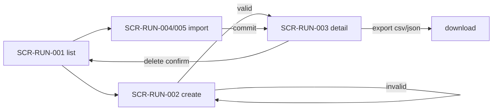
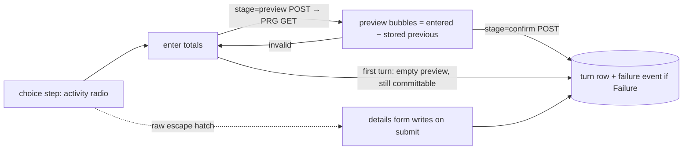

# Screen Specification

Product: **Trainer Desk** (local-only Laravel 13 tool for Trainers of the Global English version of *Umamusume Pretty Derby*). This document is the authoritative screen-level specification: every user-facing screen, its states, actions, validation, access rules, dependencies, and known gaps.

## 1. Purpose & Scope

Scope of this spec:

- All server-rendered Blade screens reachable from `routes/web.php`.
- The shared layout shell (nav, flash, theme, skip link) and the 404 error screen.
- Cross-screen workflows (run lifecycle, guided turn logging, historical import, review resolution).
- Gaps and contradictions found while tracing routes → controllers → views → Form Requests → tests.

Out of scope (summarized only where a screen touches them):

- The fetch engine and its artisan commands (`uma:fetch`, `uma:reparse`, `uma:backup`) — CLI surfaces, not screens; several screens reference them in empty-state copy.
- The read-only JSON API (`/api/v1`) — a machine surface with no visual layer (`DESIGN.md` §4.6 calls it "no visual surface"); recorded in §4.15.
- The `.agents/` skill-automation tooling layer — touches no catalog or run tables (`README.md`).

Repository terminology preserved throughout: **Trainer** (the single user), **trainee** (an Umamusume entry), **run**, **turn**, **deck**, **scenario**, `[Global]` (the Global English release server), **provenance** (source URL + fetch record). The characters are Umamusume, a humanoid race; equine vocabulary is a lore-gate failure (`CONSTRAINTS.md` C-4) and appears nowhere in this document's screen copy.

Evidence labels used below:

- **Implemented** — route + controller + view traced in this tree.
- **Partially Implemented** — screen ships, but a required-behavior element is missing or unresolved (named in its Gaps section).
- **Referenced but Missing** — a route, field, story, or component exists in docs/backend without a reachable UI (or vice versa).
- **Planned / Unknown** — PRD priority tier not yet built, or behavior not established by any repository source.

Access model (applies to every screen, so it is stated once): this tool has **no authentication surface, by design** (PRD NFR-1, PRD §6.1, `ARCHITECTURE.md` §8). One Trainer, one machine, loopback only. Every Form Request's `authorize()` returns `true`. "Unauthorized access" therefore does not exist as a screen state; the only refusals are resource-resolution failures (unknown id/slug → 404) and nested-ownership checks (a turn belonging to another run → 404 via `abort_unless`, `TrainingRunController::updateTurn/destroyTurn`). Environment restriction: the app **must not be exposed** beyond loopback (`README.md`).

## 2. Screen Inventory

Areas used (the repository's own grouping, not forced onto generic categories):

- **Runs** (Trainer-owned data, the primary workflow) — `SCR-RUN-*`
- **Catalog** (engine-written reference data, read-only) — `SCR-CAT-*`
- **Skills** (reference data; the PRD's "Screen D") — `SCR-SKL-*`
- **Support cards** (reference data) — `SCR-SUP-*`
- **Review** (Trainer decisions over engine proposals) — `SCR-REV-*`
- **Career** (the Trainer Desk 2.0 Inertia screens; `ADR-0020` §1) — `SCR-CAR-*`
- **System** — `SCR-SYS-*`

Navigation shell: `resources/js/layouts/AppLayout.vue`, the Inertia SPA shell (`ADR-0020` §1). Nine primary nav destinations in DOM order — Dashboard, New Career, Legacy Lab, Support Cards, Skills, Review, Veterans, Database, Settings — plus a focus-revealed "Skip to content" link targeting `main#main`. Veterans is a named absence (`to: null`) until the D16 slice lands, so the count is eight live plus one, which is Miller's Law (plan §13). `/` renders `SCR-CAR-001` (route name `home`), so the Dashboard is the landing screen. The Blade shell this paragraph used to describe (`resources/views/components/layout.blade.php`) was deleted in slice B1; the three error documents render themselves (`AppServiceProvider` composes them in place of the shell).

## 3. Screen Matrix

| ID | Screen | Area | Actor | Access | Route | Status |
|---|---|---|---|---|---|---|
| SCR-RUN-001 | Training runs (list) | Runs | Trainer | none required (local-only) | `GET /training-runs` (`runs.index`) | Implemented |
| SCR-RUN-002 | New training run | Runs | Trainer | none required | `GET /training-runs/create` (`runs.create`) | Implemented |
| SCR-RUN-003 | Run detail & turn log | Runs | Trainer | none required | `GET /training-runs/{run}` (`runs.show`) | Implemented (open findings, see gaps) |
| SCR-RUN-004 | Import a historical run (form) | Runs | Trainer | none required | `GET /training-runs/import` (`runs.import`) | Implemented |
| SCR-RUN-005 | Import preview & confirm | Runs | Trainer | none required | `POST /training-runs/import/preview` (`runs.import.preview`) | Implemented |
| SCR-CAT-001 | Umamusume catalog | Catalog | Trainer | none required | `GET /umamusume` (`catalog.index`) | Implemented |
| SCR-CAT-002 | Umamusume profile detail | Catalog | Trainer | none required | `GET /umamusume/{slug}` (`catalog.show`) | Implemented |
| SCR-SKL-001 | Skill search (Screen D) | Skills | Trainer | none required | `GET /skills` (`skills.index`) | Implemented |
| SCR-SKL-002 | Skill detail | Skills | Trainer | none required | `GET /skills/{skill}` (`skills.show`) | Implemented |
| SCR-SUP-001 | Support-card catalog | Support cards | Trainer | none required | `GET /support-cards` (`support-cards.index`) | Implemented |
| SCR-SUP-002 | Support-card detail | Support cards | Trainer | none required | `GET /support-cards/{card}` (`support-cards.show`) | Implemented |
| SCR-REV-001 | Match review queue | Review | Trainer | none required | `GET /review` (`review.index`) | Implemented |
| SCR-CAR-001 | Dashboard (2.0 landing screen) | Career | Trainer | none required | `GET /` (`home`) | Implemented 2026-10-06 (D1); panels for builds and legacy-goal gaps are named absences |
| SCR-CAR-002 | Scenario Selection (wizard step 1) | Career | Trainer | none required | `GET /career/setup/scenario` (`career.scenario`), written by `PUT` (`career.scenario.store`) | Implemented 2026-10-06 (D2); steps 4 to 6 are named absences until D5-wizard, D6-wizard and D7 land |
| SCR-CAR-003 | Trainee Selection (wizard step 2) | Career | Trainer | none required | `GET /career/setup/trainee` (`career.trainee`), written by `PUT` (`career.trainee.store`) | Implemented 2026-10-06 (D3); the growth-rate and scenario-suitability filters are omitted, no column holds either |
| SCR-CAR-004 | Trainee Profile (wizard step 2, read screen) | Career | Trainer | none required | `GET /career/setup/trainee/{umamusume}` (`career.trainee.profile`) | Implemented 2026-10-06 (D3); career goals, growth rates, hint skills and evolution skills are omitted by ruling; version, stat distribution, inheritance and support types are named absences |
| SCR-CAR-005 | Build Target (wizard step 3) | Career | Trainer | none required | `GET /career/setup/target` (`career.target`), written by `PUT` (`career.target.store`) | Implemented 2026-10-06 (D4); the brief's fifth purpose (Competitive Build), risk tolerance and per-skill marks are not recorded, each stated on the page |
| SCR-SYS-001 | Page not found (404) | System | Trainer | none required | error rendering for any 404 | Implemented |
| SCR-SYS-002 | Preferences | System | Trainer | none required | `GET /preferences` (`preferences.edit`), written by `PUT /preferences` (`preferences.update`) | Implemented 2026-10-04 (§7-5) |
| SCR-SYS-003 | Session expired (419) | System | Trainer | none required | error rendering for any 419 | Implemented 2026-10-04 (§7-8) |
| SCR-SYS-004 | Server error (500) | System | Trainer | none required | error rendering for any uncaught failure | Implemented 2026-10-04 (§7-8); standalone document, no database read |
| — | Design preview | System | — | — | `GET /design-preview` | Deleted; README's stale row removed 2026-10-04 (§7-1) |

Action endpoints (no screens of their own, owned by the screens that host their forms): `runs.store`, `runs.update`, `runs.destroy`, `runs.export/{format}`, `runs.turns.store`, `runs.turns.update`, `runs.turns.destroy`, `runs.skills.sync`, `runs.deck.sync`, `runs.races.store`, `runs.purchases.store`, `runs.import.store`, `review.resolve`, `preferences.update`. As of 2026-10-04 every one of these has a form posting to it; the two that did not, `runs.turns.update` and `runs.turns.destroy`, gained the turn-row editor (§7-2).

## 4. Screen Specifications

---

### SCR-RUN-001 — Training runs (list)

#### Purpose
The landing screen. Lists every run the Trainer has logged, newest first, and offers the two ways a run enters the system: create one now, or import one from a finished career's CSV.

#### User / Actor
Trainer (the only actor in the product).

#### Access & Authorization
No auth. Reads `TrainingRun::with('umamusume')->latest()->paginate(25)`.

#### Entry Points
Primary nav "Training runs"; `/` redirect; 404 page button; redirect target after deleting a run.

#### Route / Location
`GET /training-runs`, name `runs.index`.

#### Layout / Structure
Page title → action row (text link "Import a historical run", primary pill "New run") → run list (or empty state) → pagination links.

#### Data Displayed
Per row: trainee name, scenario label after a `·` separator (only when `hasScenario()`; the raw slug is never printed — config label is read via `config('scenarios.scenarios.{key}.label')`), run status label, creation date (`toDateString`).

#### Inputs
None.

#### User Actions
| Action | Trigger | Result | Navigation | Feedback |
|---|---|---|---|---|
| Open run | row link | run detail | `runs.show` | — |
| New run | pill | create form | `runs.create` | — |
| Import | text link | import form | `runs.import` | — |

#### Screen States
Initial with rows; **empty** (deliberate copy: "No runs yet … there is nothing to list until you start one" — an empty list is framed as a real state, not a failure); paginated (>25 rows).

#### Validation & Error Handling
None (no inputs). Deleted-run direct URLs resolve through route-model binding to 404 → SCR-SYS-001.

#### Security & Privacy
Trainer-owned data only; nothing sensitive. Runs are never cached (Trainer-data reads are never cached; `ARCHITECTURE.md` §6).

#### Accessibility
Nav links carry `min-h-11` (44px) targets. Empty state is plain prose (screen-reader accessible). Standard link semantics.

#### Responsive Behavior
Title/action row uses `flex-wrap`; row content `flex-wrap` so the date wraps under the name at narrow widths. No breakpoint-specific restructure.

#### Localization / Content
Hardcoded English in the component. Status label from `RunStatus::label()` (`lang/en/uma.php`), server-formatted onto the row. Dates are date-only (no timezone conversion). Scenario labels come only from `config/scenarios.php` (D-240: a scenario name must not be hardcoded in a view), and the row carries the label rather than the storage key.

#### Navigation & Workflow Relationships
`runs.create`, `runs.import`, `runs.show` forward; it is the success destination of run deletion.

#### Dependencies
`TrainingRun`, `Umamusume` models; `config/scenarios.php` for labels.

#### Implementation References
Page: `resources/js/pages/Runs/Index.vue`; Controller: `TrainingRunController::index`; Route: `routes/web.php:29`; Tests: `RunsIndexTest.php` (props), `tests/browser/runs.spec.ts` (empty state and the action controls).

#### Current Status
Implemented.

#### Open Questions / Gaps
None specific. (Filter/search over runs is not built and is not required by any story.)

---

### SCR-RUN-002 — New training run

#### Purpose
Start a run: pick a trainee (and optionally the costume card the career was started on), name the scenario, set initial status, and optionally record inheritance parents, the Grade Point period, shop countdown, and notes.

#### User / Actor
Trainer.

#### Access & Authorization
No auth. The trainee option list is restricted to `release_status = GlobalReleased`; costume cards to `unconfirmed = false` and ordered by debut-first (`cardScope` equivalence with the catalog, stated in the controller). A cardless trainee is still selectable and commits with `character_card_id` empty.

#### Entry Points
`runs.index` "New run" pill; `catalog.show` "Her runs → New run" (does **not** preselect the trainee — the page's own helper copy says so, `Catalog/Show.vue`); back button from import.

#### Route / Location
`GET /training-runs/create`, name `runs.create`; submits to `POST /training-runs` (`runs.store`).

#### Layout / Structure
Page title → single form card: Trainee combobox, Scenario select, Status select, inheritance A/B selects, Grade Point period number, Shop resets number, Notes textarea, submit.

#### Data Displayed
The trainee roster as an Inertia prop (English names, plus per-trainee Japanese names and card titles / release dates / debut flags). It is also the source the inheritance-parent selects read, so the page holds one trainee list rather than two that can drift.

> **Retired 2026-10-05 (owner ruling, `ADR-0020` §1).** This field used to ship two pickers: a native
> `select` for a browser with scripting off, and a combobox a module switched on by disabling the
> first and enabling a hidden `umamusume_id` / `character_card_id` pair. A client-rendered page has no
> no-script path — with scripting off there is no page at all — so the fallback, the JSON script island
> that fed the module, and the handover between the two went with the Blade view. The combobox is the
> control.

#### Inputs
| Field | Type | Req | Default | Validation (source: `StoreTrainingRunRequest`) |
|---|---|---|---|---|
| `umamusume_id` | combobox (`role=combobox` input over a `role=listbox` popup) | required | — | integer, exists `umamusume.id` |
| `character_card_id` | combobox commit (a cardless trainee writes nothing) | optional | — | integer, exists `character_cards.id` **scoped to the submitted trainee** (join in the rule) |
| `scenario` | select | optional | "Not set (baseline strip)" | in `config('scenarios.php')` keys; `''` normalizes to null |
| `status` | select | required | `Active` | enum `RunStatus` |
| `inheritance_parent_a_id` / `_b_id` | select | optional | none | exists `umamusume.id` |
| `current_objective_index` | number 1..`RaceEntry::MAX_OBJECTIVE_INDEX` | optional | empty | in range; cross-field closure: refused when the scenario's `panels.grade_objectives` is not true ("This scenario has no Grade Point periods…") |
| `shop_resets_in` | number min 0 | optional | empty | nullable int ≥ 0 (scenario upper bound enforced at model layer) |
| `notes` | textarea | optional | empty | max:5000 |

Required marker convention: `*` on fields with no answer of their own, `(optional)` in captions that do (audit I-2).

#### User Actions
| Action | Trigger | Result | Feedback |
|---|---|---|---|
| Create run | submit | run row + card's Global-released innate/unique skills seeded as `Suggested` ("Starting" label), in one transaction (KI-33) | redirect `runs.show`, flash "Run created." |
| (Combobox pick) | typing, arrows, Enter or a click on a row | filters the trainee/card list and commits the pair the form posts | live `aria-live="polite"` status line |
| (Enter with no cursor) | Enter while nothing is highlighted | the form submits; it is not a silent re-pick of row zero | native submission |

#### Screen States
Initial (popup closed, live region silent: a count stated before anyone opened the list reports a list nobody asked for); validation-error re-render with the flashed input rehydrating every field, the combobox re-painting its label from the `umamusume_id` / `character_card_id` pair rather than from a stored string; in-flight (`aria-busy`) while the write is posted.

#### Validation & Error Handling
Server-authoritative (`StoreTrainingRunRequest`), errors rendered per field from the Inertia `errors` prop. A committed label the Trainer edits away clears the posted pair, so the next submit fails `required` rather than writing a run that disagrees with its own input (the server cannot see that disagreement: trainee and card agree with each other). Duplicate/mismatch cases: card not owned by trainee → field error. Empty scenario → null, not error. No client-side blocking beyond native `required` on the status select (kept no-looser-than-server, audit I-1/I-2 rule).

#### Security & Privacy
CSRF through the framework XSRF cookie header Inertia sends with every write. All user-entered content is Trainer's own; card titles are source data and reach the page through Vue interpolation, which escapes them.

#### Accessibility
Combobox implements `role=combobox` with `aria-expanded`, `aria-controls`, `aria-autocomplete="list"` and `aria-activedescendant`, over a `role=listbox` that carries its own accessible name, with `aria-required` on the input (the value that posts is the committed pair, not the text typed). The caption's `for` points at the input and the caption text is a prefix of the accessible name, so a speech-input user can say the words on screen (WCAG 2.5.3). Per-trainee headers and the band seam are `role=presentation` and `aria-hidden`, which puts each trainee's name in her options' own accessible names rather than in a group that owns nothing. Every control meets the 44px floor (`h-11` / `min-h-11`, KI-37). Tests: `tests/Feature/TraineeSelectorTest.php` (the payload and the POST round trip) and `tests/browser/runs.spec.ts` (the ARIA surface, the keyboard path, the cap, the commit, the stale-pair rule and the rehydration), `docs/research-scratch/AUDIT-AND-VERIFICATION.md`, section `## UIX-AUDIT-TRAINING-RUNS.md` C-1…C-4 closed same-day 2026-10-03.

#### Responsive Behavior
Form capped `max-w-lg`. No dedicated breakpoint behavior.

#### Localization / Content
Hardcoded English. `·` middle dot as separator (em/en dash banned in shipped copy, R-02). Japanese names shown only in the combobox payload (list rows are English names).

#### Navigation & Workflow Relationships
Success → SCR-RUN-003. Sibling entry SCR-RUN-004 (import) shares its Form Request contract via inheritance (`ImportHistoricalRunRequest extends StoreTrainingRunRequest`).

#### Dependencies
Models `Umamusume`, `CharacterCard`, `TrainingRun`, `Skill` (pre-populate through `Skill::availableOnGlobal()`); `config/scenarios.php`; component `resources/js/components/TraineeCombobox.vue`.

#### Implementation References
Page: `resources/js/pages/Runs/Create.vue` (+ `components/TraineeCombobox.vue`); Controller: `TrainingRunController::create/store`; Request: `app/Http/Requests/StoreTrainingRunRequest.php`; Tests: `TraineeSelectorTest.php`, `RunCreateSurfaceTest.php`, `TrainingRunTest.php` (create + pre-populate cases), `tests/browser/runs.spec.ts`.

#### Current Status
Implemented.

#### Open Questions / Gaps
- `legacy_selection` (ADR-0010, `TrainingRun` fillable + `LegacySelectionPayload`) is stored and modeled but **no form field collects it on this screen** — Referenced but Missing (§7-3).
- Audit C-5 ("the request validates four fields the create form never sends") is resolved for inheritance/objective/shop fields; the legacy-selection half remains.

---

### SCR-RUN-003 — Run detail & turn log

#### Purpose
The work surface for one run: read the run's current state (resources, stats, mood), log turns through a guided two-stage rail (with a raw escape hatch), maintain skills (plan-vs-actual), record the equipped support deck, record races against the career calendar or by hand, record Trackblazer shop purchases, report the Grade Point period and shop rotation, export, and delete.

#### User / Actor
Trainer.

#### Access & Authorization
No auth. `{run}` route-model bound; unknown id → 404. Nested writes re-check ownership (`abort_unless($turn->training_run_id === $run->id, 404)`).

#### Entry Points
`runs.index` rows; flash redirects from its own actions; `catalog.show` "Her runs"; import commit redirect; export links.

#### Route / Location
`GET /training-runs/{run}` name `runs.show`. Query-string screen state: `?entry_mode=calendar|manual` (race panel branch), `?year=N` (career-year tab), `?deck_slot=N` (open deck slot), `?skill_row=N` (open skill row). Writes: `runs.update` (PUT), `runs.destroy` (DELETE), `runs.export/{format}` (GET), `runs.turns.store` (POST), `runs.skills.sync` (POST), `runs.deck.sync` (POST), `runs.races.store` (POST), `runs.purchases.store` (POST).

#### Layout / Structure
1. Status banner (`role="status"`, only after a save redirect back).
2. Header: trainee name + status label + scenario label (or "No scenario set"); export CSV/JSON links; import provenance line when `imported_at` is set.
3. Notes line when set.
4. Pinned **Resources** strip (`lg:sticky`, pinned at ~176px after fix `f5a91b2`) + Mood pill beside it ("not recorded" when absent).
5. **Stats** band (scrolls; renders only when ≥1 turn logged — five zeros would be a claim; D-220).
6. Scenario-composed panels (only when the run names a scenario): race calendar (gated `panels.race_calendar`), grade-point meter, shop panel, race panel, team-rank gauge, spirit-burst roster, team-race panel, epithet checklist, race-fatigue chip. Each component self-gates on the composition matrix (`config/scenarios.php`), so a scenario that does not open a mechanic renders nothing (D-221, G-34).
7. **Turn log** section: "Change scenario" form → "Report period" form (when the scenario composes grade objectives) → Support deck (`x-deck-panel`) → Turns heading + empty note or nine-column table (Turn, Speed, Stamina, Power, Guts, Wit, SP, Condition, Mood; failure chips with penalty kind) → guided rail (`x-guided-step`) with the turn-entry grid → error envelope list → "Correct a turn by hand" `
` escape hatch → Skills section → delete-run `
`.

#### Data Displayed
- Resource strip widgets per scenario (`turn`, `energy`, `fans`, plus `team_rank`, `spirit_bursts` on Unity Cup); an unrecorded value renders `N/A` + `title`, never a default or dash.
- Stat band: latest turn's five stats against scenario caps (`ScenarioCaps::forRun`, same call the validator makes, KI-47 fixed), 1200 halving marker as its own visible term (ADR-0002 UI condition), skill points.
- Mood pill: five client tiers GREAT…AWFUL with directional arrow (color is not the only channel, D-12/D-259).
- Skill lists grouped Starting(`Suggested`)/Acquired/Skipped with ✦ Unique mark + word, SP cost, turn acquired.
- Deck rows: card display name, slot label (position 6 always reads `Friends`), rarity/type words, derived `Scenario Link` badge, at-cap effects.
- Race rows: title, status, "Trainer-entered" mark, grade/placement/turn/circles/period as applicable.
- Shop: spend total ("Spent: N coins"), rotation countdown, catalogue rows (Trackblazer only).
- Provenance for imported runs: `Imported {date} from {import_source}`.

#### Inputs
| Group | Fields | Validation source |
|---|---|---|
| Change scenario | `scenario` (hidden carry: `umamusume_id`, `status`) | `StoreTrainingRunRequest` |
| Report period | `current_objective_index` select incl. "Not reported" | same (cross-field scenario rule) |
| Guided turn rail | `choice` (radio), then `turn`, `speed`, `stamina`, `power`, `guts`, `wit`, `sp`, `energy` (post-turn total), `fans`, `mood`, `outcome`, `penalty_kind`, plus `stage`/`previewed` markers | `StoreTurnEntryRequest` |
| Raw escape hatch | `turn`, five stats, `sp`, `condition` | same request, no `stage` (hatch stays valid) |
| Skill rows | `skills[N][skill_id|status|turn_acquired]` (N rows + one spare) | `StoreRunSkillRequest` |
| Deck | `deck[1..6][support_card_id]` | `StoreDeckRequest` |
| Race | `entry_mode`, calendar ids or manual `title/month/half/tier`, `status`, `placement`, `fans_gain`, `circles`, `objective_index`, `turn_entry_id` | `StoreRaceEntryRequest` |
| Shop purchase | `turn`, `item`, `cost`, `effect` | `StoreShopPurchaseRequest` |
| Delete run | confirm disclosure then submit | — |

Stat bounds: each of the five stats `0..scenario ceiling` (`ADR-0015`: base cap + scenario bonus; run with no scenario stays at 1200; the browser `max` on inputs mirrors the same caps so client and server never disagree); SP non-negative and uncapped; energy `0..100`; mood enum; fans ≥0. Turn unique per run (ignoring the edited row).

#### User Actions
| Action | Trigger | Preconditions | Result | Feedback |
|---|---|---|---|---|
| Preview this turn | rail submit `stage=preview` | nothing writes (D-51) | PRG redirect back to `runs.show` with flashed input; rail re-renders in outcome step with delta bubbles (entered minus previous stored turn; zeros omitted; first turn has nothing to subtract and the rail says so) | — |
| Confirm turn | rail submit `stage=confirm` | `previewed=1` marker must have been rendered first (server-enforced UX guard, not security) | turn row written; a `Failure` outcome also writes a `turn_events` Failure row (penalty kind + recorded down-deltas + origin note "Logged from the client, not modelled") | status "Turn N logged."; rail resets to choice step |
| Save correction | raw form submit | writes on submit, no preview | turn created | status message |
| Save skill status | skills form | upsert semantics (`syncWithoutDetaching`): unlisted skills keep state; only `availableOnGlobal` skills writable | rows updated | "Skill status saved." |
| Save deck | deck form | all six slots posted (blanks are deliberate clears); delete-then-insert in one transaction; duplicate card refused | deck replaced | "Deck saved." |
| Record race | race panel | calendar branch names a slot on **this run's** scenario/year; manual branch creates a `free_race` slot too; one entry may not set both ids | `race_entries` row (+slot) | "Race recorded." |
| Record purchase | shop panel | item in the scenario catalogue at the stated price; holding-cap counted from stored rows | `turn_events` Scenario row | "Purchase recorded." + field errors |
| Report period / rotation | respective forms | shared request carried through | run updated | status banner |
| Export CSV / JSON | header links | format ∈ {csv, json} else 404 | attachment download `run-{id}.{format}` | — |
| Change scenario | scenario form | matrix keys | run updated | "Run updated." |
| Delete run | disclosure → submit | permanent, cascade to turns/skills | run gone | redirect list + "Run deleted." |

Rail keyboard path: digits 1–9 choose an activity, arrows rove (native radio group), Enter previews, Escape returns focus to the choices — advertised on-screen, never folklore; module `resources/js/guided-flow.ts`; everything degrades with scripting off (buttons are plain submits).

#### Screen States
No turns yet (band absent, rail still offers the door, empty-list line "No turns logged yet. Add the first one below."); loaded; choice step → outcome/preview step (server state via `previewed`, not client state); first-turn preview (empty deltas, committable); validation error (input rehydrated into the rail and/or hatch, error envelope list under the rail, `role`-consistent single treatment); deck empty = named absence with instruction; skills empty catalogue = KI-51 first-run message naming `uma:fetch gametora-skills` / `uma:reparse …`; race slots empty ("Races are fetched data, and this career year has none of them." / `No races recorded for this run.`); Energy `null` = "Energy not yet recorded" (no five empty cells); Energy band Safe(>50)/Caution(≥30)/Danger(<30, stated as the tool's own ruling — client publishes no threshold below 50); low-Energy Hint advisory under 50 with its arithmetic shown; unauthorized state does not exist (no auth).

#### Validation & Error Handling
As tabled above; failure path for every write is redirect-back with `old()` rehydration (the rail and the escape hatch rehydrate independently, never each other's fields — `showData` is gated on the rail's `stage` marker to keep that true). Business refusals surface as field errors, not exceptions (audit B1 moved the circles refusal into the Form Request so a Trainer-correctable mistake is recoverable). Model-layer guards stay behind request rules for non-UI writes.

#### Security & Privacy
All writes CSRF-protected. Deck/skill catalogues include only `[Global]` rows on the pickers, while a card/skill already on the run is re-offered so logging an older deck never dead-ends (server comments state this). Turn-acquired, placement, circles etc. are Trainer statements; no third-party data displayed. No rate limits (local tool).

#### Accessibility
Skip link; pinned strip below 25% viewport (measured 176px, O-2 closed); each panel its own `section` with `aria-label` (Run state, Resources, Stats, Skills, Race calendar, Turn log — O-4 closed); turn table inside a focusable scroll region (`role=region tabindex=0 aria-label="Turn log"`, KI-25 convention shared with the import table); status region `role=status`, error lists and race/shop refusals `role=alert`; failure chips carry the word "Failed" (D-12); Unique mark ✦ plus word; `h-11`/44px controls and Screen-D focus ring on the skill form (KI-37); per-row `<label for>` on skill controls (KI-36); `step="1"` steppers (DESIGN.md §6.14); previous-turn placeholders, never pre-filled values (an input arriving with a number asserts a fact, D-220). Tests: `KeyboardPathTest`, `RunViewFrameTest`, `RunViewTargetSizeTest`, `RunViewNoScriptTest`, `RunSaveConfirmationTest`, `GuidedTurn*` family.

#### Responsive Behavior
`lg:` sticky only at ≥1024px; below `lg` everything stacks one column. Turn-entry grid `grid-cols-2 md:grid-cols-4`. Nine-column turn table scrolls horizontally rather than reflowing. Race panel options measured against 390px viewport (`min-w-0` allowances). Shell `max-w-5xl`. A systematic responsive pass is recorded as **not** done (`docs/research-scratch/AUDIT-AND-VERIFICATION.md`, section `## UIX-AUDIT-TRAINING-RUNS.md` "What this audit could not verify").

#### Localization / Content
Group label `Suggested` renders as **Starting** (O-11/R-6 copy ruling in `lang/en/uma.php`; DB value unchanged). Rest/Recreation activity names are client-captured strings (I-3); no invented facility labels (D-20). Energy/Fans labels state "after this turn" (O-3 disambiguation direction; whether total-vs-delta is *the* model stays open — §7). Dates via `M j, Y`; datetimes through `config('uma.display_timezone')`; date-only stays date-only. No em dash in copy (`N/A` + title is the disclosure glyph).

#### Navigation & Workflow Relationships
Hub of WF-001/002/005/006/007. Links out to `skills.index` ("Search the skill catalog to narrow that list"), `support-cards.show` (deck rows), `catalog.show` (skill-holder links are from SCR-SKL-002, not here).

#### Dependencies
`TrainingRun`, `TurnEntry`, `TurnEvent`, `RunSkill`, `DeckSlot`, `RaceEntry`, `ScenarioSlot`, `RaceCatalogSlot`, `SupportCard`, `Skill` models; `ScenarioCaps`; `SupportCardEffects`; `ShopPurchasePayload`; `config/scenarios.php` (composition matrix — single source of what this screen renders); `ImportHistoricalRun` for provenance lines.

#### Implementation References
View: `resources/views/runs/show.blade.php` (681 lines); components `guided-step`, `stat-band`, `resource-strip`, `mood-pill`, `race-calendar`, `race-panel`, `deck-panel`, `shop-panel`, `grade-point-meter`, `team-rank-gauge`, `spirit-burst-roster`, `team-race-panel`, `epithet-checklist`, `race-fatigue-chip`; Controller: `TrainingRunController` (show/storeTurn/syncSkills/syncDeck/storeRace/storePurchase/export/destroy + `showData`); Requests: `StoreTurnEntryRequest`, `StoreRunSkillRequest`, `StoreDeckRequest`, `StoreRaceEntryRequest`, `StoreShopPurchaseRequest`; JS: `resources/js/guided-flow.ts`; Tests: `GuidedFirstTurnTest`, `GuidedTurnStagesTest`, `GuidedTurnOnRunViewTest`, `GuidedTurnValidationTest`, `RunDeckTest`, `RunSkillPickerTest`, `RunSkillRowLabelsTest`, `RunSaveConfirmationTest`, `RunWriteAtomicityTest`, `GoalPanelsOnRunDetailTest`, `GradePointMeterTest`, `FreeRaceWriterTest`, `HistoricalRunImportTest`.

#### Current Status
Implemented. `docs/research-scratch/AUDIT-AND-VERIFICATION.md`, section `## UIX-AUDIT-TRAINING-RUNS.md` carries a live **Fail verdict (2026-10-03)** for this page after the owner pass; Part 7 subsequently closed the blockers (O-2, O-4, R-5, R-6, R-8, item 14 both halves). Open at filing time: O-11 skills-panel design, O-8 deck tiles + per-card state, O-12 goals surface, O-3 total-vs-delta wording, O-5/R-7 unseeded race slots, R-2/R-3 schema asks, `Infirmary`/`Races` turn choices, contested Rest figure.

#### Open Questions / Gaps
- `runs.turns.update` / `runs.turns.destroy` exist (controller + tests) but **no UI control posts to them** — turn rows have no Edit/Delete action (§7-2).
- Team rank / spirit bursts / team-race rounds display explanatory panels with **no capture control** (R-2, O-6/O-7): Unity Cup numbers read `N/A` with no way to fill them.
- Goals surface (client header "Place 1st in Arima Kinen, 5 turns") does not exist (O-12).
- Per-card deck state (level, limit break, bond, hint) is cut by design (ADR-0014 "identity, not collection") but the audit records the trainer-facing cost; a schema proposal needs an Architect/PRD gate before it can change.
- Race calendar correctness is data-blocked: 406 of 410 `race_catalog_slots` rows carry no `scenario_key` (O-5 correction note), so year/scenario filtering cannot be honest until seeded.

---

### SCR-RUN-004 — Import a historical run (form)

#### Purpose
Bring a finished career in from the CSV this app itself exports, either chosen as a file or pasted. Nothing is written at this step; the next step shows every row before commit.

#### User / Actor
Trainer.

#### Access & Authorization
No auth. Trainee list = `GlobalReleased` only (no card gate: a paper sheet records the trainee, not her form — `character_card_id` is not collected here by design).

#### Entry Points
`runs.index` "Import a historical run" link; `runs.import` "Start over" self-link from the preview state.

#### Route / Location
`GET /training-runs/import` name `runs.import`; submits to `POST /training-runs/import/preview` (`runs.import.preview`), `multipart/form-data`.

#### Layout / Structure
Title → explainer paragraph ("the file has to be correct before the run exists") → form: Trainee select, Scenario select, Status select (default **Completed**, deliberately different from create's Active), Notes, CSV file input, paste textarea with the exact expected header line as placeholder/helper, submit.

#### Data Displayed
Header line from `ImportHistoricalRunRequest::HEADERS` (single source: `turn,speed,stamina,power,guts,wit,sp,condition,energy,mood,fans` — the same columns `export()` writes).

#### Inputs
| Field | Type | Req | Validation (`ImportHistoricalRunRequest extends StoreTrainingRunRequest`) |
|---|---|---|---|
| `umamusume_id` | select | required | parent rules |
| `scenario` | select | optional | parent rules |
| `status` | select | required | parent rules |
| `notes` | textarea | optional | max:5000 |
| `file` | file `.csv` | one-of | `nullable, file, mimes:csv,txt, max:1024`; when both present the upload wins (request copies it into `csv` before validation) |
| `csv` | textarea | one-of | `required, string` **server-side only** — no native `required` here, because the browser constraint would close the upload path (audit I-1 blocker, message: "Paste the run's CSV or choose the file to import.") |

Parsing/normalization facts visible to the Trainer: UTF-8 BOM tolerated, CRLF tolerated, blank lines skipped, mood words upper-cased on read, short rows reject the whole file rather than guessing shifted columns.

#### User Actions
| Action | Trigger | Result |
|---|---|---|
| Preview import | submit | parse + validate rows → SCR-RUN-005 |
| (back to form) | "Start over" on preview | fresh form |

#### Screen States
Initial; validation error (textarea preserved via `old('csv')`; per-row errors point at the row that held the offending cell); empty catalogue trainee list simply offers fewer options.

#### Validation & Error Handling
Rows validated as `turns.*` nested rules before preview: turn required/integer/≥1/**distinct** ("Two rows claim the same turn number"), stats required vs scenario caps (an import is measured by the same `ScenarioCaps` the turn form uses), sp/energy/mood/fans/condition as on turns. 1..200 rows max (career length + headroom; a longer sheet is called out as a transcription error rather than truncated). Unusable first line → `turns.required` message quoting the exact header.

#### Security & Privacy
CSRF; upload contents read once from disk into a request field; the browser filename is kept as provenance (`import_source`), the server path never shown.

#### Accessibility
Labels on every control; the preview table (on SCR-RUN-005) is the scrollable region, form itself simple.

#### Responsive Behavior
`max-w-2xl` form card; stacked field list.

#### Localization / Content
Copy names the limitation plainly: import carries **turns only**; skills/deck/races stay empty and are added per-turn on the run page.

#### Navigation & Workflow Relationships
Forward: SCR-RUN-005. Failure loop: the same page re-rendered with the Inertia `errors` prop.

#### Dependencies
`Umamusume`; `config/scenarios.php`; `TrainingRunController::importForm/importChoices`.

#### Implementation References
Page: `resources/js/pages/Runs/Import.vue` (form branch); Controller: `TrainingRunController::importForm`; Request: `ImportHistoricalRunRequest`; ADR: `docs/adr/0017-historical-run-import.md`; Tests: `HistoricalRunImportTest`, `tests/browser/run-import.spec.ts` (the KI-46 composite sentence, which the MessageBag test could not reach).

#### Current Status
Implemented.

#### Open Questions / Gaps
- Skills/deck/races cannot be imported (file format has no columns; stated on screen). A richer interchange shape is unrequested (PRD §6.7 forbids legacy import tooling generally).

---

### SCR-RUN-005 — Import preview & confirm

#### Purpose
Show every turn row that will be written, plus the run's identity line, and require an explicit second POST to commit. The preview is *not* a trust boundary: the commit re-runs the identical validation, which is why raw CSV text travels in a hidden textarea rather than a signed token.

#### User / Actor
Trainer.

#### Access & Authorization
As SCR-RUN-004.

#### Entry Points
Only the previous form's submit (no GET route — this state is reached by `POST runs.import.preview` rendering the same view with a `preview` payload).

#### Route / Location
Rendered by `POST /training-runs/import/preview`; commits via `POST /training-runs/import` (`runs.import.store`).

#### Layout / Structure
"Confirm the import" heading → identity line (trainee · scenario-or-"No scenario (baseline strip)" · status · turn count) → note region stating turns-only semantics → scrollable `role=region tabindex=0 aria-label="Rows to import"` table (11 columns matching HEADERS) → buttons: "Import N turns" (primary) / "Start over" (link).

#### Data Displayed
Every parsed row verbatim as raw strings straight from the parse (which is also what makes a rejected cell point at its row).

#### User Actions
| Action | Result | Feedback |
|---|---|---|
| Import N turns | `ImportHistoricalRun` writes run + all turns in one transaction; records `imported_at` + `import_source` (filename, or `pasted CSV ({8-char hash})` for pastes) | redirect `runs.show`, status "Imported N turns." |
| Start over | new form GET | — |

#### Screen States
Preview loaded; re-validation failure on commit (edits to the flashed textarea are rejected on the second POST and the form re-renders with errors — no partial write ever reaches the action).

#### Validation & Error Handling
Same request class both steps; a half-failed file leaves no partial history (transaction).

#### Accessibility
Table has an `sr-only` caption "Every turn row that will be written"; scroll region keyboard-focusable.

#### Localization / Responsive / Security
As SCR-RUN-004; table scrolls, never reflows (nine-plus columns will not fit a phone).

#### Navigation & Workflow Relationships
Success → SCR-RUN-003 with import provenance line visible there.

#### Dependencies
`ImportHistoricalRun` action; `TrainingRun` fillable `imported_at`/`import_source`.

#### Implementation References
Page: `resources/js/pages/Runs/Import.vue` (preview branch, gated on the `preview` prop); Controller: `TrainingRunController::importPreview/importStore`; Action: `app/Actions/ImportHistoricalRun.php`; Tests: `HistoricalRunImportTest` (two-POST semantics pinned), `tests/browser/run-import.spec.ts`.

#### Current Status
Implemented. (Documented as a separate ID because it is a distinct workflow state with its own commit action; it shares the physical view file.)

#### Open Questions / Gaps
None observed beyond SCR-RUN-004's.

---

### SCR-CAT-001 — Umamusume catalog (roster tree)

#### Purpose
Browse the trainees whose JP and Global data the engine cross-referenced, each with her confirmed costume forms nested. Read-only (PRD US-1, FR-A-3).

#### User / Actor
Trainer.

#### Access & Authorization
No auth. Default view is **GlobalReleased only** — "a catalog whose first screen is half JP-only rows is not the Global English tool PRD §1 describes." Unconfirmed forms (single-source) are hidden unless `?show_unconfirmed=1`.

#### Entry Points
Nav "Catalog"; 404 button; return links from detail.

#### Route / Location
`GET /umamusume` name `catalog.index`. Query contract: `status` (enum value or `all`; any other value is refused and the request lands on this canonical URL with the field named, `ADR-0018`), `search` (normalized), `show_unconfirmed` (boolean), `page` (>=1), `pageSize` (honoured, clamped 1..100, default 25).

#### Layout / Structure
Title → GET filter form (Search, Release status select, Show unconfirmed checkbox, Filter submit) → roster tree (each trainee row: name + optional Japanese name, max-rarity chip, form count or "no forms recorded", status label; nested form rows: verbatim client title, rarity chip, debut mark, "Not confirmed by two sources" flag, Global release date) → pagination preserving query string.

#### Data Displayed
Trainee name, `name_ja`, `release_status` label; cards' title/rarity/debut/global date/unconfirmed. Search matches normalized `match_key` **plus aliases plus card titles** (folded at comparison time by raw SQL `normalizedColumn()`; a card match surfaces its trainee — the page is organized at trainee level). Known search ceiling stated in code: diacritics and width-variant folding do not work portably in SQLite (`[Nuit Étoilée de Scarlet]` will not answer `nuit etoilee`); upgrade path recorded as a schema decision, not made here.

#### Inputs
Search (free text; `%`/`_`/`\` escaped so a wildcard query cannot dump the catalog — KI-26's shape fixed here), status select, unconfirmed opt-in (GET form ⇒ a reload, not live typing).

#### User Actions
Filter (submit), open detail (row link), paginate (links carry `withQueryString()`), toggle unconfirmed.

#### Screen States
Loaded; **empty-search** ("No Umamusume match. The catalog is filled by seed data or `php artisan uma:fetch`."); empty-catalogue (same message pre-fetch).

#### Validation & Error Handling
Unknown `status` values are refused by `CatalogSearchRequest` and redirected to the canonical catalog with the field named beside the picker; `status=` (empty) is the no-filter default rather than an error. One contract for all three filter surfaces, decided in `ADR-0018`, which supersedes this screen's earlier documented deviation.

#### Security & Privacy
Read-only; Blade escaping; LIKE metacharacter escaping; cached payloads are ids+count only, never model objects (`serializable_classes => false` guard, KI-2).

#### Accessibility
No collapse widget was added by measured decision (68 trainees = three pages, each already expanded; a disclosure would add a keyboard stop and hide nothing — G-11 reasoning recorded in the view); `h-11` filter controls; semantic `<ul>` tree with `h2/h3` per level.

#### Responsive Behavior
Rows `flex-wrap`; card meta wraps under the title at narrow widths.

#### Localization / Content
Status labels via enum→`lang/en/uma.php`. Card titles are **verbatim source data including brackets**; the lore gate sits on the display path, and this page prints them as published. Dates date-only.

#### Navigation & Workflow Relationships
→ SCR-CAT-002. No control here writes.

#### Dependencies
`Umamusume`, `CharacterCard` (with `cardScope()` order: debut first, Global date, source card id); `NameNormalizer`; `Cache::remember` behind `catalog:version` (bumped on promotion; Trainer data never cached).

#### Implementation References
Page: `resources/js/pages/Catalog/Index.vue`; Controller: `CatalogController::index` (+`cardScope`, `normalizedColumn`, `cached`); Tests: `CatalogTest`, `CatalogRosterTreeTest`, `CatalogCacheRenderTest`, `tests/browser/catalog.spec.ts`.

#### Current Status
Implemented.

#### Open Questions / Gaps
- `pageSize` up to 100 exists but no UI exposes it ("the lever if that ever changes", view comment). Unresolved requirement, minor.

---

### SCR-CAT-002 — Umamusume profile detail

#### Purpose
Everything this tool knows about one trainee: identity and profile facts, aptitude, costume forms (tabbable per form), her skill lists, her runs, aliases, and provenance — with every absence named in words (PRD US-1 acceptance, FR-A-4/A-7).

#### User / Actor
Trainer.

#### Access & Authorization
No auth; unknown slug → 404. Unconfirmed forms obey the same `cardScope` disclosure as the list; `?form=` may only select a visible form (a stale shared link falls back to the first form instead of 404-ing or revealing a hidden one).

#### Entry Points
Catalog rows; skill-holder links (SCR-SKL-002); support-card "Belongs to" (SCR-SUP-002); direct/shared URL.

#### Route / Location
`GET /umamusume/{slug}` name `catalog.show`. Query: `?form={local card id}`, `?show_unconfirmed=1`.

#### Layout / Structure (binding order per WS-2)
Header (name, "Back to catalog") → **Basic information** (Japanese name, voice actor JP + EN line, Release date Global-or-JP-only, birthday, height, three sizes) → status dl (Release status, JP debut, Global debut, "Edited by Trainer" `is_manual` statement) → JapanOnly notice when applicable → **Aptitude** grid (ten letters, once, not per form) → **Costume forms** (a link strip when >1 form via `FormTabs.vue`; inline panel when exactly one; each panel `FormDetail.vue`: verbatim title, rarity/debut/unconfirmed marks, its own `source_url`/`snapshot_path`/`fetched_at` line) → hidden-forms count + "Show unconfirmed forms" link → **Skills** (four groups: unique/innate/awakening/event, resolved through `Skill.export_id`, `SkillRow.vue` links only for rows Screen D serves) → **Goal races** (named absence — KI-34 reservation, no table exists) → **Her runs** (last 10 with status, scenario label, turn count) + "New run" (helper states it does not preselect) → **Aliases** → **Provenance** (trainee-level `data_sources` last 10, with the sentence separating it from the per-form/per-card inline provenances).

#### Data Displayed
Profile nullability is *measured and normal*: `va_en` absent on 10 of 135, `three_sizes` on 10, `birth_year` on 17 of 163 rows — every absence renders as a named sentence ("Not published by the source", "No English dub listed", "· year not published"), never a blank, zero, or guessed date. Base stats and stat bonuses are deliberately absent (ADR-0012 Decision 1: columns authorized, not built). `skills_evo` is stored but **not listed**: most of its ids name skills `[Global]` has not shipped and the detail route refuses them, so listing would emit 829 dead links.

#### Inputs
None (display only). Form tabs are plain `<Link>`s carrying `?form={local card id}` (and `?show_unconfirmed=1` while the lever is on), so the choice is addressable and survives a reload; the active tab carries `aria-current="page"`.

#### User Actions
Switch costume form (tab + commit), show unconfirmed, open a skill (only when Global-released and client-named), start a run (no preselect), read provenance links.

#### Screen States
Loaded; profile-not-yet-fetched (Japanese name still prints; the sentence names `uma:fetch gametora-character-profiles`); all-forms-hidden variant of the empty-forms state ("Every costume form recorded for this trainee is hidden as unconfirmed."); no runs; no aliases; no fetched sources ("This record was seeded or entered by hand.").

#### Validation & Error Handling
Unknown slug → 404. Out-of-scope `?form=` → silent fallback to first visible form (stated design, not an error).

#### Security & Privacy
Provenance link text comes from `config('uma.sources')` / stored columns, never from a fetched body; snapshot path is named, not linked (disk path). `is_manual` disclosed so the Trainer knows the engine will not overwrite her.

#### Accessibility
`aria-labelledby` sections; dl/dt/dd semantics; the costume-form strip is a `<nav aria-label="Costume forms">` of links, the active one carrying `aria-current="page"` (native keyboard targets, `min-h-11`); Japanese script rendered as data with no re-casing.

#### Responsive Behavior
Profile grid `grid-cols-2 md:grid-cols-3`; status dl `md:grid-cols-4`.

#### Localization / Content
`japaneseName()` prefers the profile row and falls back to the trainee column — one resolution path, stated. Dates date-only; fetched timestamps shown in `config('uma.display_timezone')` with zone suffix.

#### Navigation & Workflow Relationships
Back to SCR-CAT-001; forward to SCR-SKL-002, SCR-RUN-002 (generic create, no preselect — recorded on the button itself so the affordance does not lie).

#### Dependencies
`Umamusume`, `UmamusumeProfile`, `CharacterCard`, `Skill`, `TrainingRun`, `DataSource`; `Catalog/Show.vue` with `FormTabs.vue`, `FormDetail.vue`, `AptitudeGrid.vue`, `SkillRow.vue`, `RarityChip.vue`.

#### Implementation References
Page: `resources/js/pages/Catalog/Show.vue` (+ `components/catalog/{FormTabs,FormDetail}.vue`, `components/{AptitudeGrid,SkillRow,RarityChip}.vue`); Controller: `CatalogController::show`; Tests: `CatalogDetailPageTest` (asserts the props), `CatalogSkillListsTest`, `tests/browser/catalog-detail.spec.ts`, `GametoraCharacterProfileParserTest`.

#### Current Status
Implemented.

#### Open Questions / Gaps
- Goal races: named absence; `trainee_goals` reserved (KI-34) — needs a fetch source decision (Data Engineer/owner).
- Aptitude search/width folding ceiling (§7-10 cross-reference to catalog index's SQL limitation).

---

### SCR-SKL-001 — Skill search (Screen D)

#### Purpose
Find a skill among the `[Global]`-released catalogue by name fragment, derived type, and unique flag (PRD FR-D-2/D-3; the run UI's picker is too long to scan, and this screen is the honest narrowing tool).

#### User / Actor
Trainer.

#### Access & Authorization
No auth. Read path only; **every query starts from `Skill::availableOnGlobal()`** — a JP-only or third-party-named row cannot reach this screen (ADR-0011 §2, PRD FR-D-3). No cache (the screen's class docblock explains why `catalog:version` would be a lie for this table; reads measured 0.3–0.8 ms).

#### Entry Points
Nav "Skills"; run page "Search the skill catalog" link; skills/show return link.

#### Route / Location
`GET /skills` name `skills.index`. Query: `search` (≤120), `type` ∈ parser categories ∪ `Unspecified`, `unique` boolean, `page`, `pageSize` (1..100 clamped in controller).

#### Layout / Structure
Title → GET filter form (Search, Type select incl. "Unspecified", Unique-only checkbox, Filter) → invitation line (only when no query is in flight — D-65: two states are not one screen) → facet error → results count line "X of Y skills available on [Global]" → result rows (name link → detail, Japanese name only when it differs, ✦ Unique pill + word, type word, SP cost or `N/A` + explanatory title) → pagination → footer explaining that the type word is this tool's derivation, not client copy, and that the "Unspecified" facet finds the rows the sign rule withheld.

#### Data Displayed
The D-30-permitted Skill surface only: name, name_ja, sp_cost, type, is_unique. Not rendered, each with a stated reason: icon (column unimported, G-SK-19), description (both English description fields fail the terminology table, G-SK-16/20), rarity/class code (ADR-0011 §3).

#### Inputs
Search matched against `match_key` via normalized LIKE with an explicit `ESCAPE '\'` and pre-escaping of `%_` (KI-26 fixed on this surface); case/spacing-insensitive by construction. Unknown `type` value → refused, redirected back, field named (a dropped facet would "answer a question nobody asked with the whole catalog").

#### User Actions
Filter; open skill detail; paginate.

#### Screen States
Pre-fetch empty table (distinct copy naming both `uma:fetch gametora-skills` and the `uma:reparse` KI-27 trap); no-results naming the ask (`"…"` + type + unique) and stating a missing skill is a data gap, not a query mistake — deliberately **no** link to the review queue (skills bypass `match_candidates` by design, so a link would promise what cannot happen); loaded.

#### Validation & Error Handling
`SkillSearchRequest`; `page/pageSize` coerced rather than refused.

#### Security & Privacy / Accessibility / Responsive
CSRF n/a (GET); `h-11` inputs measured against DESIGN.md §6.14; checkbox at the 24px WCAG 2.2 AA floor (the tool's first checkbox); rows are a `<ul>` with wrap-baselines; no breakpoint structure beyond wrap.

#### Localization / Content
Latin-script "Japanese" names (`#LookatCurren` etc.) dedupe against the English column so 18/623 rows don't print the string twice — a display rule, data stays verbatim. Type words are this tool's derived classification, never client copy (D-20).

#### Navigation & Workflow Relationships
→ SCR-SKL-002; reached from SCR-RUN-003's skills section.

#### Dependencies
`Skill`; `NameNormalizer`; `GametoraSkillsParser::CATEGORIES`; `StoreSkills` (write path, referenced by copy).

#### Implementation References
Page: `resources/js/pages/Skills/Index.vue`; Controller: `SkillController::index` (+`query`, `describeAsk`, `availableCount`); Request: `SkillSearchRequest`; ADR: `docs/adr/0011-skills-reference-import.md`; Tests: `SkillSearchScreenTest` (asserts the props), `tests/browser/skills.spec.ts`, `SkillsFetchTest` (family).

#### Current Status
Implemented.

#### Open Questions / Gaps
- Running-style eligibility display is an open product question (PRD OQ-5) — nothing here is authorized; the screen must not become a recommendation surface (OQ-5 forbids `best_for` outright).

---

### SCR-SKL-002 — Skill detail

#### Purpose
One skill's full record: fields, mechanics as the source states them, the trainees whose forms hold it, and the absences the data genuinely has.

#### User / Actor
Trainer.

#### Access & Authorization
No auth. Route param is the **local** `skills.id`; lookup starts from `availableOnGlobal()`, so an id the scope rejects is the same 404 as an unknown one. The export id never reaches the screen.

#### Entry Points
Screen-D rows; run-page/skill cross links from SCR-CAT-002 `SkillRow.vue`; support-card lists.

#### Route / Location
`GET /skills/{skill}` name `skills.show`.

#### Layout / Structure
Header (name + deduped Japanese line, "Back to skill search") → dl (Type, SP cost, Unique) → **Mechanics** (per activation group: condition/precondition as monospace engine expressions, base time ms, effect chips `effect {type}: ±{value}`; footer states these are the source's own data, and that description/awakening thresholds are not recorded) **or** its absence paragraph naming the three missing things → **Held by trainees** in four groups (unique/innate/awakening/event links to catalog detail, unconfirmed forms excluded) → **Provenance** (source link + read date, or "seeded or entered by hand").

#### Data Displayed / Inputs / Actions
Display only; link actions. No editing surface on this screen: the engine writes skills; the Trainer's skill opinions live on runs (C-3).

#### Screen States
Loaded; no mechanics recorded (naming absence); no holders ("No trainees recorded with this skill."); unknown/rejected id → 404.

#### Validation, Security, Accessibility, Responsive, Localization
As SCR-SKL-001 (same view idiom; holder links use slug routes; monospace data blocks are text, selectable).

#### Navigation & Workflow Relationships
→ SCR-CAT-002 holders; ← SCR-SKL-001, SCR-CAT-002, SCR-SUP-002.

#### Dependencies
`Skill`, `CharacterCard` (JSON `whereJsonContains` over the four lists, `json_valid` guarded, missing-column tolerated with `QueryException` narrowing).

#### Implementation References
Page: `resources/js/pages/Skills/Show.vue`; Controller: `SkillController::show` (+`holderRows`, `holders`); Tests: `SkillDetailTest` (asserts the props), `CatalogSkillListsTest` (mirror read), `tests/browser/skills.spec.ts`, `GametoraSkillsParserTest`.

#### Current Status
Implemented.

#### Open Questions / Gaps
- Rendering mechanics expressions is **beyond D-30's current Skill entry**; the widening ask travels in `docs/research-scratch/PLANS-AND-BRIEFS.md` (view comment) — documentation pending an owner ruling.

---

### SCR-SUP-001 — Support-card catalog

#### Purpose
Browse all 559 published support cards with rarity/type/availability facets and a sort. Deliberately **not** pre-filtered to `[Global]` — availability is a facet the Trainer picks, because the stored generated `release_status` column exists to state it per row, and pre-filtering would copy that decision silently onto the read side.

#### User / Actor
Trainer.

#### Access & Authorization
No auth. Read-only; the engine writes `support_cards`, deck writes live on runs.

#### Entry Points
Nav "Support cards"; deck rows (detail); return links.

#### Route / Location
`GET /support-cards` name `support-cards.index`. Query: `rarity` ∈ {1,2,3}, `type` ∈ `SupportCard::TYPES`, `status` ∈ `SupportCard::AVAILABILITIES`, `sort` ∈ {`rarity`,`released`} (default name order); page fixed 25 (constant, "a size nobody can change is a size nobody has to reason about").

#### Layout / Structure
Title → GET filter form (four selects + Filter) → per-facet error lines → count line → card rows (assembled display name — never a stored composed name, FR-A-8(ii) — rarity chip + R/SR/SSR word, type word Wit/Pal etc., availability word, at-cap effect chips; unknown effect ids print `[Unverified] effect {id}` rather than an invented word) → pagination → footer stating the cap-anchor basis and the export-key↔client-word mapping.

#### Data Displayed / Inputs / Actions
Facet filtering and ordering with a stable tiebreaker (`char_name,title_en`) so pagination cannot reshuffle rows between pages (stated, load-bearing).

#### Screen States
Pre-fetch empty (names `gametora-support-cards` fetch + reparse trap); no-results naming the ask (no review-queue link, same reason as Screen D); loaded.

#### Validation & Error Handling
`SupportCardSearchRequest`; unknown facet values refused and redirected back **naming the route** (`$redirectRoute`, so a failed filter stays on the screen that caused it); int-vs-string key coercion pitfall handled at both ends (controller map keys + view cast).

#### Accessibility / Responsive / Localization
Same filter-surface idiom as Screen D (`h-11`, focus ring, wrap rows); client rarity/type words are display mappings over stored keys; `release_status` printed in the client's own terms.

#### Navigation & Workflow Relationships
→ SCR-SUP-002; feeds SCR-RUN-003's deck picker (`availableOnGlobal` = non-null `release_global`).

#### Dependencies
`SupportCard`, `SupportCardEffects::dictionary()` (read once per page, N+1 avoided by design), `CardRarity`.

#### Implementation References
View: `resources/js/pages/SupportCards/Index.vue` (+ `components/RarityChip.vue`); Controller: `SupportCardController::index`; Request: `SupportCardSearchRequest`; ADR: `docs/adr/0014-support-card-entities.md`; Tests: `SupportCardPageTest` (asserts the props), `tests/browser/support-cards.spec.ts`, `ApiV1SupportCardTest` (data shape), `GametoraSupportCardParserTest`.

#### Current Status
Implemented.

#### Open Questions / Gaps
- D-30 carries **no SupportCard entry at all**; the widening ask is filed in PLANS-AND-BRIEFS (view header). Card tier labels held pending a current Global source (ADR-0014).

---

### SCR-SUP-002 — Support-card detail

#### Purpose
One card's facts: identity, both server dates, availability, the trainee its source `char_id` resolves to (when this catalog tracks her), effects at cap, and the two skill lists — with unresolvable ids counted, not dropped, because silent drop would be "a lie by silence".

#### User / Actor
Trainer.

#### Access & Authorization
No auth. Local `support_cards.id` route key (the source `support_id` is not a route key — a URL that renumbered with the publisher would break).

#### Entry Points
Catalog rows; deck rows.

#### Route / Location
`GET /support-cards/{card}` name `support-cards.show` (implicit binding).

#### Layout / Structure
Header (display name, optional `name_ja`/`title_ja` line, Back) → dl (Rarity chip+word, Type word, Availability, Released in Japan, Released on [Global] — date-only never timezone-shifted, Belongs to → catalog link or the named two-way miss: 9000-block staff and untracked trainees; measured 322/559 resolve) → **Effects** (at-cap chips + basis note) → **Hinted skills** and **Event skills** (each: not-stored vs empty-stated distinction; linked rows via `SkillRow.vue`; unlinked counted in words) → **Provenance** (source, read date, and the `is_manual` "Corrected by hand, so the fetch engine leaves it alone" line — FR-B-4's stop sign placed where a Trainer can see it).

#### Data Displayed / States
Unknown dictionary rows marked by id, never labelled. No tier label (held).

#### Validation, Security, Accessibility, Responsive, Localization
Same idiom as SCR-SUP-001; no inputs.

#### Navigation & Workflow Relationships
→ SCR-CAT-002, SCR-SKL-002; ← SCR-SUP-001, SCR-RUN-003 deck.

#### Dependencies
`SupportCard`, `SupportCardEffects::atCap`, `Skill` via `availableOnGlobal`, `Umamusume` via `external_ref` string join (deliberately not a foreign key — ADR-0014 correction 1).

#### Implementation References
View: `resources/js/pages/SupportCards/Show.vue` (+ `components/SkillRow.vue`, `components/RarityChip.vue`); Controller: `SupportCardController::show` (+`skillList`, `trainee`); Tests: `SupportCardPageTest` (asserts the props), `tests/browser/support-cards.spec.ts`, `RunDeckTest` (deck read-side), parser test above.

#### Current Status
Implemented.

#### Open Questions / Gaps
Same widening ask as SCR-SUP-001; group-card scenario-link miss is a known-and-accepted gap (FR-A-9).

---

### SCR-REV-001 — Match review queue

#### Purpose
The human half of the cross-reference engine: Fuzzy and None fetch results land here as pending candidates; the Trainer confirms (merge or create), aliases, or rejects. **The engine never merges without this decision** (PRD US-5, FR-B-3).

#### User / Actor
Trainer.

#### Access & Authorization
No auth. Lists `CandidateStatus::Pending` only; resolved rows leave the view.

#### Entry Points
Nav "Review"; Screen-D/support empty states deliberately do *not* link here (those tables bypass the queue by design — a link would be a control that cannot do what it says).

#### Route / Location
`GET /review` name `review.index`; verdict `POST /review/{candidate}` name `review.resolve`.

#### Layout / Structure
Title → explainer ("Fuzzy and unmatched fetch results land here…") → per-candidate card (proposed name + optional Japanese name, tier label · source key · fetch date, engine's suggested trainee) → one form per card: verdict select (Confirm/Aliased/Rejected with in-option explanation text), numeric `umamusume_id` override pre-filled with the suggestion, alias-language select, Resolve button → stacked error list → pagination (25).

#### Inputs
| Field | Rules (`ResolveMatchCandidateRequest`) |
|---|---|
| `status` | required, enum `CandidateStatus` |
| `umamusume_id` | nullable int, exists `umamusume.id` (overrides the fuzzy suggestion as merge target) |
| `alias_language` | required when `status=Aliased`, enum `AliasLanguage` |

#### User Actions
| Verdict | Effect (`ResolveMatchCandidate`, one transaction) |
|---|---|
| Confirm | promotes the stored payload — into the suggested row when targeted, as a new row otherwise (`PromoteMatchedRecord`; `is_manual` rows untouched) |
| Aliased | records the proposed name (and Japanese name when present) as alias(es) of the target, so future fetches match automatically |
| Rejected | closes the candidate only; nothing written to catalog |

All three redirect back to the queue with "Candidate resolved."

#### Screen States
Empty ("Nothing pending. Run `php artisan uma:fetch` to populate."); pending rows; validation error (all three field errors render **stacked** per card — the request can return `umamusume_id` and `alias_language` together, and one-at-a-time fixing sends a Trainer re-submitting blind).

#### Validation & Error Handling
As above; unknown candidate id → 404.

#### Security & Privacy
CSRF; verdicts write catalog rows with provenance (the promote action carries the source key), so audit trail = `data_sources`, not a queue history table.

#### Accessibility
Audit F14 closed here: every control has an `sr-only` label **naming the candidate** ("Verdict for {proposed_name}" — a generic name on a queue of identical forms is ambiguous), `aria-invalid` + `aria-describedby` on failed fields, error list `role="alert"`, Resolve button `aria-label="Resolve {name}"` (visible label contains the accessible name, WCAG 2.5.3). Test: `ReviewFormAccessibilityTest`.

#### Responsive / Localization
Card content wraps; enum labels from `lang/en/uma.php` (tier, alias language); dates date-only.

#### Navigation & Workflow Relationships
Consumes engine output; improves SCR-CAT-001/002 data. No onward links from a resolved candidate (it leaves the view).

#### Dependencies
`MatchCandidate`, `ResolveMatchCandidate`, `PromoteMatchedRecord`, `UmamusumeAlias::firstOrCreate` uniqueness `(alias, language)` (FR-A-2).

#### Implementation References
View: `resources/views/review/index.blade.php`; Controller: `ReviewController`; Request: `ResolveMatchCandidateRequest`; Tests: `ReviewFormAccessibilityTest`, `CrossReferenceMatcherTest`, `FetchPipelineTest` (routing to queue).

#### Current Status
Implemented.

#### Open Questions / Gaps
None found. (Bulk actions are not built and no story asks.)

---

### SCR-SYS-001 — Page not found (404)

#### Purpose
Keep a missing address inside the product: same shell, same theme, one action back to work. Reached by unknown slugs/ids, deleted rows, and mistyped links.

#### Actor / Access
Any; no auth concept applies.

#### Route / Location
`resources/views/errors/404.blade.php` renders for every `NotFoundHttpException`/model-not-found on web routes (API requests get the JSON envelope instead, §4.15).

#### Layout / Content
Title "Page not found" → note block "Nothing to show here" naming the three likeliest causes → buttons: Training runs (primary), Catalog, Review.

#### States
Single state. Three custom error views exist: 404 (this screen), 419 and 500 (`resources/views/errors/`). Other statuses fall through to framework defaults. §7-8 closed 2026-10-04.

#### Implementation References
View above; `bootstrap/app.php` exception rendering (JSON vs HTML split); `docs/adr/0007-c7-loading-state-scope-for-server-rendered-views.md` (loading/error state scope for server-rendered views).

#### Status
Implemented.

#### Gaps
None open. A stale-session POST used to surface the framework page; it now renders SCR-SYS-003 (§7-8, closed 2026-10-04).

---

### SCR-SYS-002 — Preferences

#### Purpose
Let a Trainer set the two UI preferences PRD US-11 authorizes. Before 2026-10-04 the `preferences` table and the server-side theme render both existed with no way to write them, so the dark theme was reachable only by inserting a row by hand (audit O-1, §7-5).

#### Actor / Access
Any; no auth concept applies.

#### Route / Location
`GET /preferences` name `preferences.edit` (`PreferenceController::edit`), written by `PUT /preferences` name `preferences.update`. Reached by the sixth nav link in `components/layout.blade.php`. One endpoint for both keys, because writing a preference is one action on the store, not one per key.

#### Layout / Content
Title "Preferences" → one form: Theme select (Follow the system / Light / Dark) and a "Numeric failure estimate" checkbox → a visible note stating that the estimate changes no screen yet → Save preferences.

#### States
No row for `theme` means follow the OS, and the select shows that option selected; absence is a value, not a blank. `failure_estimate` defaults to `off` (US-11, ADR-0001 §3). A refused submission re-renders the screen with the field error and the other control untouched. First paint stays correct because the theme is composed server-side (D-104); the control never writes to browser storage (§6 non-goal 12).

#### Validation & Error Handling
`UpdatePreferenceRequest`: `theme` present-and-nullable, in `light`/`dark` (the empty string is the stated follow-the-OS answer, and `ConvertEmptyStringsToNull` turns the form's empty choice into null before the rules are read); `failure_estimate` present, in `off`/`on`; any other input key is refused outright, because `validated()` would drop it silently and the screen would keep believing the preference was stored. Follow-the-OS deletes the row rather than storing the word `system`.

#### Implementation References
`PreferenceController`, `UpdatePreferenceRequest`, `Preference::KEYS`, `AppServiceProvider`'s layout composer, `resources/views/preferences/edit.blade.php`; tests `tests/Feature/PreferenceControlsTest.php` and the theme cases in `DesignTokensTest.php:100-131`.

#### Status
Implemented 2026-10-04. §7-5 resolved; the failure-estimate *display* half stays blocked on a sourced model, which the screen states rather than hides.

#### Gaps
`failure_estimate` records a choice no surface reads yet. That is deliberate and disclosed on the screen: ADR-0001 §3 forbids printing a failure percentage without its formula and parameters, and no source publishes a curve, so there is no honest number to show. Not a calculation change waiting on a flag; it needs a model first (owner question).

---

### SCR-CAR-001 — Dashboard (Trainer Desk 2.0 landing screen)

#### Purpose
The front door of the 2.0 SPA (`ADR-0020` §1): resume the career in progress, reach the three destinations a returning Trainer wants first, see the newest Veterans, and read the state of the tool's own data. `screen-spec-2.0.md` SCREEN-001; `design-2.0.md` §4 (hierarchy), §29 (empty states), §48 (data versioning).

#### Actor / Access
Any; no auth concept applies (PRD NFR-1).

#### Route / Location
`GET /` name `home` (`DashboardController::index`). Reached by the first nav destination and by any bare loopback URL. The Blade landing page this route used to redirect to (`/training-runs`) is still reachable at its own route; the redirect is gone.

#### Layout / Content
`<Head title="Dashboard">` and the `#title` slot, then five panels in order:

1. **Active career** — trainee name (with the Japanese name in `lang="ja"`), scenario label, career position (`Senior Year · Early July`, on the client's 24-turn grid), logged turn count, Energy, and the scenario's one widget beyond the three every scenario composes (Team Rank, Grade Points, and so on), read from `config/scenarios.php` `widgets[]` by subtraction against the baseline entry. Primary action "Resume Career" links to the run.
2. **Quick actions** — New Career, Legacy Lab, Support Cards. Every destination is a live route; a destination whose slice had not landed would render as a named absence, not a dead link.
3. **Recent Veterans** — the three newest rows from C3's `ListVeterans`, each linking to its run, plus a link to the full library.
4. **Recent builds** — a named absence. A build is the Career Plan a run holds (`build_target`, C1) and the wizard that enters one is D2–D7, so there is no build record to list.
5. **Data status** — the `GLOBAL DATA ● Current` badge with the verification date from `config('scenarios.verified_at')`, the ruleset row, and the three catalogue counts.

#### States

| State | Behaviour |
|---|---|
| Empty (no active career) | The active-career panel states what is missing, why it matters and what to do: "No active career. Start a new training run.", one sentence on what a career holds, and a "Start a new training run" action. The rest of the page is unchanged, so the screen is usable on first load (Paradox of the Active User, plan §13). |
| Empty (no Veterans) | The Veterans panel states the absence and the path out of it (finish a run, set it to Completed, save it from the Legacy Lab) with a link to the library. `total` is `0`, never a count printed as though it were a fact about the Trainer. |
| Empty (no turn logged) | Career position and Energy render `N/A` with a `title` naming the absence, never `0` and never Early January (D-220). |
| Empty (scenario resource) | The resource renders `N/A` with its reason on the element: no column records a scenario resource yet. |
| Loading | Page-level `role="status"` "Loading…" while an Inertia visit started from this screen is in flight. This page has no other user-initiated async action, so no skeleton is drawn (`design-2.0` §30, ADR-0007). |
| Error | Page-level `role="alert"` for a visit that could not complete. The `invalid` and `exception` listeners return `false`, which takes the failure out of Inertia's default modal so this screen's own alert is the single surface; both listeners are removed on unmount. A failed *read* of this page itself renders `SCR-SYS-004`. |

#### Validation & Error Handling
No inputs and no writes, so no Form Request and no validation. The ruleset row prints `N/A` with a `title` because `app.ruleset` is null: no source defines a Global ruleset version (`design-2.0` §48).

#### Implementation References
`app/Http/Controllers/DashboardController.php`; `resources/js/pages/Dashboard.vue`; `config/scenarios.php` `verified_at`, `widget_labels`, `baseline`; `App\Models\TrainingRun::stripValues()` / `careerYearForTurn()`; `App\Actions\ListVeterans`; shared props in `app/Http/Middleware/HandleInertiaRequests.php`. Tests: `tests/Feature/DashboardTest.php` (props), `tests/browser/dashboard.spec.ts` (rendered copy, 44px sweep, keyboard path).

#### Status
Implemented 2026-10-06 (slice D1). The empty/loading/error states above ship with the screen.

#### Gaps
Three, each stated on the screen or in the slice report rather than hidden:

1. **Recent builds** is a named absence until the Career Plan wizard lands (D2–D7). Not a bug.
2. **Legacy-goal gaps** is omitted entirely: a gap is the run's targets set against inherited stats, which is the inheritance computation `ADR-0020` §3 bans. C1 and C3 hold no honest comparison.
3. **A scenario resource value** is always `N/A` because no column records one; the run page's resource strip renders it the same way. Wiring Team Rank and Grade Points to their own readers (`latestTeamRank()`, `gradeEarned()`) is a follow-up that needs the D4 provenance badge, because `gradeEarned()` is calculated rather than entered or stored.

---

### SCR-CAR-002 — Scenario Selection (setup wizard step 1)

#### Purpose
Choose the career scenario that decides which resources the tool tracks, which systems it can show and which stat ceilings apply (`docs/proposals/screen-spec-2.0.md` SCREEN-002; `design-2.0` §13, §25, §48).

#### Actor / Access
Any; no auth concept applies (PRD NFR-1).

#### Route / Location
`GET /career/setup/scenario` name `career.scenario` and `PUT /career/setup/scenario` name `career.scenario.store` (`App\Http\Controllers\Career\ScenarioSelectController`). Reached from the Dashboard's New Career flow and by URL; the wizard shell is `resources/js/layouts/SetupLayout.vue`, which is this screen's and no other's until its sibling steps land.

#### Layout / Content
`SetupLayout` step 1 of 6, then one card per scenario the matrix composes, in the matrix's own order. Each card states the scenario's name, what it optimizes, its systems, its tracked resources, its turn loop, its Global availability date, its ruleset version, a description slot and a recommended-use slot. One `Select Scenario` action per card (`aria-pressed`), and a stored-choice line above the grid.

**Every field is derived from `config/scenarios.php` by `ScenarioSelectController::cards()`, and the page holds no `config()` lookup and no scenario name.** Optimization focus is read off `cap_bonus` (highest-bonus stat, or a stated uniform tie), systems are the `panels` entries that are `true` labelled through `panel_labels`, tracked resources are the `widgets` beyond the baseline entry's own list labelled through `widget_labels`, and the documentation badge comes from `documented`. `CareerScenarioSelectTest` proves the claim by injecting a fifth scenario into the matrix at runtime and reading its card back, so a new scenario is one config entry and zero component edits (D-240, gate G-33).

#### States

| State | Behaviour |
|---|---|
| Empty (no draft choice) | The stored-choice line renders `N/A` with a `title` naming the absence, and every card's action is `aria-pressed="false"`. Nothing is pre-selected, so the screen never implies a choice nobody made. |
| Empty (no scenario composed) | The grid is replaced by a statement that the matrix holds no scenario, so the screen cannot show an empty grid and call it a choice. Reachable only by deleting every entry from `config/scenarios.php`. |
| Absent field per card | Ruleset `N/A` (`app.ruleset` is null by ruling), Description `N/A` and Recommended use `N/A`, each with a `title` giving the reason. No scenario composes systems or resources beyond the baseline: those read "No scenario system" and "None beyond the generic strip" rather than as blank rows. |
| Loading | `role="status"` "Saving your choice…" while the PUT is in flight, and the clicked button reads "Saving…" while its own visit runs. A custom state is required here because the action is user-initiated (ADR-0007); there is no cold-load skeleton (Inertia renders after the props arrive). |
| Error | `role="alert"` carrying the Form Request's message, referenced from the actions by `aria-describedby`, so the refusal is announced with the control that caused it. The draft is left untouched: an unknown key never reaches the session. |
| After a successful write | The PUT redirects back to this step and the choice is read from the session, so the pressed state reflects stored data rather than client memory. Focus is restored to the same action in the visit's `onSuccess` — not on mount, because a component instance survives a client-side visit and stealing focus on cold load would be a defect (WCAG 2.4.3). |
| Unbuilt steps | The step nav renders steps 4 to 6 as named absences (`to: null`, "not built") and the page states that there is nothing to continue to. No dead link. |

#### Validation & Error Handling
`App\Http\Requests\Career\StoreScenarioRequest`: `scenario` required, string, and `Rule::in` the keys of `config('scenarios.scenarios')`. A key outside the matrix is refused rather than stored, because `SetupDraft::read()` validates the stored key on the way out and a refused write is honest while a stored-then-dropped one is not. A stale key left by a later config change reads as no scenario.

#### Persistence
The choice goes to `session('career.setup')` through `App\Services\Career\SetupDraft`, **not** to a `training_runs` row. `SetupDraft`'s class docblock carries the reasoning: `RunStatus` has no draft case, and an `Active` run created here would surface as a phantom career on SCR-CAR-001 and as a phantom builder target in SCR-CAR-006. The run is created once, at Preflight (D7). Accepted costs, stated rather than hidden: two tabs share one draft (last write wins), and an expired session loses it.

#### Implementation References
`ScenarioSelectController`, `StoreScenarioRequest`, `SetupDraft`, `SetupLayout.vue`, `pages/Career/ScenarioSelect.vue`, `config/scenarios.php` (`widget_labels`, `panel_labels`, `baseline`, `verified_at`). Tests: `tests/Feature/CareerScenarioSelectTest.php` (10 cases) and `tests/browser/career-scenario-select.spec.ts` (6 cases: card count, baseline-only derivation, badge state, keyboard selection with focus restore and cross-navigation survival, 44px sweep, 320px reflow with a clean console).

#### Status
Implemented 2026-10-06 (slice D2). Steps 2 to 6 of the wizard are D3, D4, the D5 and D6 wizard steps, and D7.

#### Gaps
1. **Description and recommended use are named absences.** Neither the corpus nor the matrix holds a one-line player-facing description or a recommended use for any scenario, so the card prints `N/A` with a reason. Whether `config/scenarios.php` should gain a sourced `description` per scenario is an owner question.
2. **The documentation badge is driven by a flag that currently reads true.** `our_grand_concert.documented` became `true` when commit `ab53861` recovered the 2026-10-05 primary read, so no card renders PARTIALLY DOCUMENTED today. The badge mechanism is pinned against a falsified matrix in the props test, and its positive rendering needs no component change if the owner rules the scenario only partially documented. The scenario's *baseline* state (no systems, no resources) is visible either way.
3. **No axe run.** `@axe-core/playwright` and `axe-core` are both absent and adding a dependency needs owner approval (`AGENTS.md` §5), so the plan §12.5 fallback applies: the browser spec asserts target size, keyboard path, focus order, reflow and a clean console by hand.

---

### SCR-CAR-003 — Trainee Selection (setup wizard step 2)

#### Purpose
Choose the trainee a career is built on, from the fetched catalog, before the run exists (`docs/proposals/screen-spec-2.0.md` SCREEN-003; `design-2.0` §13, §17).

#### Actor / Access
Any; no auth concept applies (PRD NFR-1).

#### Route / Location
`GET /career/setup/trainee` name `career.trainee` and `PUT /career/setup/trainee` name `career.trainee.store` (`App\Http\Controllers\Career\TraineeSelectController`). Reached from `SetupLayout`'s step nav (step 2) and by URL. Each row's "View Profile" action leads to SCR-CAR-004 at `GET /career/setup/trainee/{umamusume}` (`career.trainee.profile`), which binds the local primary key rather than the slug, because the id this step stores is the one a later step writes to `training_runs.umamusume_id`.

#### Layout / Content
`SetupLayout` step 2 of 6, then a scenario line read through `SetupDraft::scenarioLabel()` (`N/A` with a `title` when no scenario has been chosen), a stored-choice line, the filter form, and one card per trainee in the catalog's own order (debut form first, then Global release date, then card id, with solo-sourced forms hidden).

The filter form offers four kinds of filter and one sort, every one a real column: name/slug substring search; a Surface facet over `aptitude_turf`/`aptitude_dirt`; a Distance facet over the four distance columns; a Running style facet over the four style columns (facet letters are the parser's `S A B C D E F G` domain, `GametoraCharacterParser.php:143`); a unique-skill select over the `character_cards.skills_unique` exports that survive `Skill::scopeAvailableOnGlobal()`; a sort allowlist over the same columns with a direction control; Filter and Clear filters. The facet vocabulary, the letter domain, the sort keys and the unique-skill options all arrive as props from `TraineeSearchRequest` and the controller, so the page holds no column name, no letter list and no scenario name.

Each card prints name and `name_ja` (`lang="ja"`), release status, the `size-10` `ArtworkSlot` row geometry (`reserve`, decorative `alt=""`, because the row already prints the name), the ten `AptitudeBadge` letters (letter plus band word, never colour alone), per-form `RarityChip` with the client's rarity word and a debut marker, a primary "Select Trainee" action (`aria-pressed`) and a "View Profile" link. No growth-rate figure and no scenario-suitability rank appear, because no column holds either (see Gaps).

#### States

| State | Behaviour |
|---|---|
| Empty (no draft choice) | The stored-choice line renders `N/A` with a `title` naming the absence, and every action is `aria-pressed="false"`. Nothing is pre-selected, so the screen never implies a choice nobody made. |
| Empty (no row matches the filters) | The grid is replaced by one sentence stating that no trainee matches, with the path out of it: the roster is filled by seed data or `php artisan uma:fetch`, and Clear filters shows every row the catalog holds. |
| Empty (no aptitude published) | The row's grid is replaced by "Aptitude: N/A" with a `title`: the parser writes all ten columns or none, so one absent letter means the whole set is absent (D-220). |
| Absent filter (growth rate, scenario suitability) | The form does not offer them at all: no column holds either figure, and a facet for a column that does not exist would be a filter that can never narrow. Recorded in Gaps. |
| Loading | `role="status"` "Loading the roster…" while a filter visit is in flight, and the pressed action reads "Saving…" while its own PUT runs. A custom state is required here because the action is user-initiated (ADR-0007); there is no cold-load skeleton (Inertia renders after the props arrive). |
| Error (refused filter) | The Form Request redirects back to the step and the message is listed per field with `role="alert"`, so the refusal is announced where it was typed. The roster stays unfiltered: a refused value never narrows the list as though it had been applied. |
| Error (refused write) | `StoreTraineeRequest` messages re-render this step; the draft is left untouched, so an unknown id never reaches the session. |
| After a successful write | The PUT redirects back to this step and the pressed state is read from the session, so it reflects stored data rather than client memory. Focus is restored to the same action in the visit's `onSuccess` (not on mount: a component instance survives a client-side visit, and stealing focus on cold load would be a defect, WCAG 2.4.3). |
| Unbuilt steps | The step nav renders steps 4 to 6 as named absences (`to: null`, "not built"); step 4 is not linked, because the Legacy wizard step has not landed. |

#### Validation & Error Handling
`App\Http\Requests\Career\TraineeSearchRequest`: `search` nullable string, max 255; `surface`, `distance` and `style` nullable and in the seven letters the parser writes; `skill` nullable integer existing in `skills.export_id`; `direction` in `asc`/`desc`. An empty facet value reads as "no filter chosen". An unknown `sortBy` degrades to the default (`name`) rather than refusing, the way `PageSize::clamp` degrades: the key usually arrives from a pasted URL, and the allowlist is the only path into `orderBy()`, so an off-list key never becomes SQL. An aptitude sort ranks S to G through a CASE expression rather than the alphabet, so a G trainee is not presented as the best choice in the list. `App\Http\Requests\Career\StoreTraineeRequest`: `umamusume_id` required, integer, existing in `umamusume.id`.

#### Persistence
The choice goes to `session('career.setup')` through `App\Services\Career\SetupDraft`, the same draft step 1 writes, **not** to a `training_runs` row: an `Active` run made here would surface as a phantom career on SCR-CAR-001 and as a phantom builder target in SCR-CAR-006, and the run is created once, at Preflight (D7). SCR-CAR-002's section carries the full reasoning; the accepted costs are the same (two tabs share one draft, an expired session loses it).

#### Implementation References
`TraineeSelectController`, `TraineeSearchRequest`, `StoreTraineeRequest`, `SetupDraft`, `SetupLayout.vue`, `pages/Career/TraineeSelect.vue`, `AptitudeBadge.vue`, `RarityChip.vue`, `ArtworkSlot.vue`; `App\Services\PageSize`. Tests: `tests/Feature/CareerTraineeSelectTest.php` (props, filters, sort, draft) and `tests/browser/career-trainee-select.spec.ts` (rendered copy, filters and the empty match, keyboard selection with focus restore, the 44px sweep, 320px reflow, clean console).

#### Status
Implemented 2026-10-06 (slice D3). Step 4 and beyond are the D5-wizard, D6-wizard and D7 slices.

#### Gaps
1. **Growth rate and scenario suitability are omitted, with citations.** Neither has a column: `docs/research-scratch/GOVERNANCE.md:600` defers a growth-rate column ("No column added now") and `docs/research-scratch/DESIGN-CORPUS.md:727-728` keeps the figure off a rendered surface; a suitability facet would read `config/scenarios.php`'s `scenario_links` cast list as a ranking, which is a listing, not a judgement the tool holds a source for.
2. **Rarity is a form's fact, not a trainee's.** `character_cards.rarity` is the only rarity in the schema, so the card prints it per costume form and offers no trainee-level aggregate, which would state a property the data does not carry.
3. **The unique-skill option list is built from the card rows in PHP.** `skills_unique` is a JSON column and a portable SQL distinct over it does not exist; this is one bounded read per page load on the current catalog. The upgrade path is a pivot if the catalog grows an order of magnitude.
4. **No axe run.** `@axe-core/playwright` and `axe-core` are both absent and adding a dependency needs owner approval (`AGENTS.md` §5), so the plan §12.5 fallback applies and the browser spec's hand-rolled checks are the coverage.

---

### SCR-CAR-004 — Trainee Profile (setup wizard step 2, read screen)

#### Purpose
State what the catalog holds about one trainee before the choice is committed: basic facts, her own aptitude letters, and the skills of each costume form (`docs/proposals/screen-spec-2.0.md` SCREEN-004; `design-2.0` §13, §17).

#### Actor / Access
Any; no auth concept applies (PRD NFR-1).

#### Route / Location
`GET /career/setup/trainee/{umamusume}` name `career.trainee.profile` (`App\Http\Controllers\Career\TraineeProfileController`), reached from SCR-CAR-003's "View Profile" action. The parameter binds the local primary key; an unknown id is the binding's 404, which is what a stale bookmarked draft deserves. The Select action posts to the shared `career.trainee.store` PUT.

#### Layout / Content
`SetupLayout` step 2 of 6, a back link to the roster and the scenario line, then four sections:

1. **Basic** — `size-16` artwork, name with `name_ja` (`lang="ja"`), availability, voice actor, birthday, height, Version and whether the row is Trainer-edited. The profile document is read through `hasFullBirthday()`/`hasThreeSizes()` guards, so a partial birthday or measurement is never printed as a whole one. There is no weight column, so no weight row exists.
2. **Aptitude** — the ten letters once for the trainee, through `AptitudeGrid.vue`; never repeated per costume form (ADR-0008), and stated as aptitude rather than as an "ideal" judgement.
3. **Costume forms** — one block per confirmed form: `size-10` artwork, form title, `RarityChip` with the client's rarity word, debut marker and Global release date, then the form's four skill lists (unique, starting, awakening, event). Skill names resolve through `Skill::scopeAvailableOnGlobal()`, so every printed name has a link that resolves on the Global client; `sp_cost` prints `N/A` with a `title` where the source publishes none; an id that resolves to no Global skill is counted in words rather than dropped. `skills_evo` is deliberately not listed (SCR-CAT-002's ruling).
4. **Build analysis** — recommended stat distribution, useful inheritance and useful support types as named absences, each `N/A` with its reason on the element, plus the distance/style reading labelled as aptitude. Career goals is not rendered at all: `trainee_goals` has never been migrated (the filing is reserved as KI-34), and `race_catalog_slots`' own comment says its obligation rows are scenario-scoped and "deliberately not the per-character Goal".

#### States

| State | Behaviour |
|---|---|
| Empty (no draft choice) | The Select action is `aria-pressed="false"` and no "Chosen" word appears, so the screen never implies a choice nobody made. |
| Empty (no profile document) | Voice actor, birthday and height render `N/A` with a `title`; the rest of the screen is unchanged, so a trainee fetched without a profile document is still readable. |
| Empty (no confirmed costume form) | The forms list is replaced by one sentence: every form for this trainee is confirmed by a single source, so no skill list can be stated until a second source confirms one. |
| Empty (no aptitude published) | "Aptitude: N/A" with a `title`, the same all-or-nothing read as the roster. |
| Empty (a skill list publishes nothing this catalog can resolve) | `N/A` with a `title` when the source lists none; where the source lists ids this catalog cannot resolve, the count is stated in words instead of a short list presented as the whole (6 of the catalog's 237 awakening ids are in that state). |
| Absent (version, stat distribution, inheritance, support types) | Each renders `N/A` with its reason on the element: an unrecorded value is never a dash and never a default. |
| Omitted (career goals, growth rates, hint skills, evolution skills) | No heading and no row: each has no column or no per-trainee store, and a heading over nothing would advertise a fact the tool is known not to hold. |
| Loading | The Select action reads "Saving…" while its PUT is in flight (ADR-0007). The page itself is a read with no other async action, so no skeleton is drawn. |
| Error | A refused write re-renders SCR-CAR-003 with the message: `StoreTraineeRequest` redirects to the roster step, which is where the choice is made. A failed read of this page renders SCR-SYS-004. |
| After a successful write | The PUT redirects to SCR-CAR-003, where the stored choice rather than this screen's client state states what is selected. |

#### Validation & Error Handling
The read takes no untrusted input beyond the route key; the only write is the shared `StoreTraineeRequest` (see SCR-CAR-003). An unknown route id is a 404 through the model binding before any query runs.

#### Persistence
The same `session('career.setup')` draft as SCR-CAR-003, through the same PUT. Nothing on this screen writes a database row.

#### Implementation References
`TraineeProfileController`, `pages/Career/TraineeProfile.vue`, `AptitudeGrid.vue`, `SkillRow.vue`, `RarityChip.vue`, `ArtworkSlot.vue`; `App\Models\Skill::scopeAvailableOnGlobal()`. Tests: `tests/Feature/CareerTraineeSelectTest.php` (props, resolution counts, absences) and `tests/browser/career-trainee-select.spec.ts` (rendered sections, N/A titles, the omitted headings).

#### Status
Implemented 2026-10-06 (slice D3).

#### Gaps
1. **Career goals is omitted, not stubbed.** No `trainee_goals` migration, model or factory exists; the filing is reserved as KI-34 and needs a fetch-source decision, so the section the SCREEN-004 brief asks for has nothing to render today.
2. **Growth rates, hint skills and evolution skills are omitted.** Growth rates have no column and are kept off rendered surfaces by `DESIGN-CORPUS.md:727-728`; hint skills live only on `support_cards`; `skills_evo` is stored but SCR-CAT-002's ruling refuses to list evolved pairs.
3. **Six of the catalog's 237 awakening ids name no Global skill row** and are counted rather than resolved; closing that needs a source comparison, not a UI change.
4. **The three build-analysis absences are by ruling**, not by omission: there is no recommendation column, `support_cards` carries no `umamusume_id`, and inheritance is run-scoped. The rows stay in place so a future source has a surface waiting.
5. **No axe run.** The same plan §12.5 fallback as SCR-CAR-003.

---

### SCR-CAR-005 — Build Target (setup wizard step 3)

#### Purpose
Record what the Trainer intends to build for this career, as one object entered before the run exists (`docs/proposals/screen-spec-2.0.md` SCREEN-005; `design-2.0` §49 for the provenance states; `ADR-0020` §1, §2).

#### Actor / Access
Any; no auth concept applies (PRD NFR-1).

#### Route / Location
`GET /career/setup/target` name `career.target` and `PUT /career/setup/target` name `career.target.store` (`App\Http\Controllers\Career\BuildTargetController`). Reached from `SetupLayout`'s step nav (step 3) and by URL. The write is validated by `App\Http\Requests\Career\StoreDraftBuildTargetRequest`, which extends the run-scoped `StoreBuildTargetRequest` so both entry points share one rule set and one `payload()` builder; the ceiling resolves against the route's run when there is one and against `SetupDraft::planningRun()` when there is not.

#### Layout / Content
`SetupLayout` step 3 of 6, heading "Your target", then the scenario line (label through `SetupDraft::scenarioLabel()`, `N/A` with a reason when none is chosen), the absence line when no target is stored, and one form with three groups plus a summary:

1. **What the career is for** — purpose, distance, surface and style. Purpose options are `BuildPurpose`'s four cases labelled through `uma.build_purpose`; the other three vocabularies are `BuildTargetPayload::DISTANCE_BANDS`, `::SURFACES` and `::STYLES`, sent from the controller so the form and the payload's own reader cannot drift. One line discloses that the design also names a fifth purpose (Competitive Build) this tool does not record.
2. **Stat targets** — five numeric inputs, one per `config('scenarios.stat_order')` entry, each with its cap printed beside it (`ScenarioCaps::forRun`, the same call the turn validator makes, `ADR-0015`) and a labelled bar showing the entered value against that cap. The bar never renders without its number beside it, and it is not a readiness verdict: whether a target is reachable in the turns left is held computation in this repository.
3. **Skill priorities** — free-text entry plus an ordered list with "Move up", "Move down" and "Remove" buttons, each at least 44px; no drag path is required (WCAG 2.5.7). One line states that a risk tolerance and per-skill marks (Required, High, Optional, Ignore) are not recorded.
4. **Summary** — one sentence assembled by the page from the entered values alone (`ProvenanceBadge` state `calculated`), with an empty field named in the sentence rather than omitted.

`ProvenanceBadge.vue` is the single owner of the four provenance states from `design-2.0` §49: ✓ Confirmed, ∑ Calculated, ~ Estimated, ? Unknown, each a distinct glyph and a distinct word held in one map, and no other source repeats either. The accessible name is the state word plus the caller's `title` when one was given; the glyph is `aria-hidden="true"`; and the badge sits beside the figure it labels, never in a page-level legend (Law of Proximity).

#### States

| State | Behaviour |
|---|---|
| Empty (no stored target) | The page states that no target is recorded and every field starts empty; no stat input is pre-filled with a zero. The summary names each absence. |
| Empty (no scenario chosen) | The caps fall back to the base cap with no bonus (`ScenarioCaps::forRun(null)`'s own answer) and the scenario line renders `N/A` with a `title` saying so. Nothing lends a bonus nobody chose. |
| Absent (design items the payload cannot hold) | The fifth purpose, risk tolerance and per-skill marks are each stated in one line: `BuildTargetPayload::KEYS` is exactly six keys and `assertKeys()` refuses an unknown one, so offering them would be a stored-shape change needing owner approval. |
| Loading | The submit button reads "Saving…" and a `role="status"` line says "Saving your target…" while the PUT is in flight (ADR-0007: the action is user-initiated). There is no cold-load skeleton (Inertia renders after the props arrive). |
| Error | Each message renders with `role="alert"` under its own control and is referenced by `aria-describedby`; on a failed submit focus moves to the first invalid control in DOM order. The refusal names the bound it enforced ("Speed must be between 0 and 1200.", D-56) and the draft is untouched. |
| After a successful write | The PUT redirects back to this step with "Build target saved." and the stored state is read from the draft, so the form reflects stored data rather than client memory. |
| Unbuilt steps | The step nav renders steps 4 to 6 as named absences (`to: null`, "not built"). Step 3 is live and carries `aria-current="step"`. |

#### Validation & Error Handling
`StoreDraftBuildTargetRequest` (extends `StoreBuildTargetRequest`): `purpose` required and one of `BuildPurpose`'s four cases; `distance`, `surface` and `style` required and in `BuildTargetPayload`'s constants; `targets` required and key-restricted to the stat matrix, all five stats required by name, `min:0`, each checked in `withValidator` against `ScenarioCaps::forRun` for the draft's planned scenario with the bound named. A hand-made POST cannot store a sixth stat, an unknown purpose or a value outside the vocabularies. The form is `novalidate` by design: the `max` attribute mirrors the cap as a browser convenience only, and the server's message is the one the page renders. The server is the authority on the clamp (`ADR-0015`).

#### Persistence
The target goes to `session('career.setup')` under the `build_target` key through `App\Services\Career\SetupDraft`, **not** to a `training_runs` row: the run is created once, at Preflight (D7), and SCR-CAR-002's section carries the reasoning. `SetupDraft::write()` merges into the raw session bag, so a later step-1 or step-2 write cannot drop the target. The run-scoped write (`runs.build-target.update` → `training_runs.build_target`) is unchanged and shares the same rule set.

#### Implementation References
`BuildTargetController`, `StoreDraftBuildTargetRequest`, `StoreBuildTargetRequest`, `SetupDraft` (`planningRun()`, `buildTarget()`, `write()`), `ScenarioCaps::forRun`, `BuildTargetPayload`, `BuildPurpose`, `uma.build_purpose`, `pages/Career/BuildTarget.vue`, `components/ProvenanceBadge.vue`, `SetupLayout.vue`. Tests: `tests/Feature/CareerBuildTargetTest.php` (props, draft round trip, the ceiling clamp with its bound named, refusal of off-vocabulary values, the untouched run-scoped write, the glyph sweep) and `tests/browser/career-build-target.spec.ts` (rendered copy, the save round trip with the calculated summary, the refused stat with focus, keyboard reorder, the 44px sweep, 320px reflow with a clean console).

#### Status
Implemented 2026-10-06 (slice D4).

#### Gaps
1. **The design's fifth purpose is not recorded.** The brief names six; `BuildPurpose` holds four, and its docblock already maps one design name (General Training) onto a stored case. "Competitive Build" has no case, and adding one would widen the advisor's contract, so the page discloses the gap in one line instead. Whether the case should exist is an owner question.
2. **Risk tolerance and per-skill marks (Required, High, Optional, Ignore) are not recorded.** Both would need a new `build_target` key, and `BuildTargetPayload::assertKeys()` refuses an unknown one, so this is a stored-shape change needing owner approval. `skill_priorities` stays a flat ordered list of names.
3. **No axe run.** `@axe-core/playwright` and `axe-core` are both absent and adding a dependency needs owner approval (`AGENTS.md` §5), so the plan §12.5 fallback applies and the browser spec's hand-rolled checks are the coverage.

---

### 4.15 Non-screen surfaces (for completeness)

- **Read-only JSON API (P2, US-9, FR-E)** — `routes/api.php`: `GET /api/v1/umamusume[/{slug}]`, `/training-runs[/{id}]`, `/support-cards[/{id}]`. No visual surface; list envelope `{data, pagination{page,pageSize,totalItems,totalPages}}`; every non-2xx renders `{error:{code,message}}` centrally (`bootstrap/app.php`: VALIDATION_ERROR/422, NOT_FOUND/404, HTTP_ERROR, INTERNAL/500). Controllers `app/Http/Controllers/Api/V1/*`, Resources `app/Http/Resources/*` (camelCase). Tests: `ApiV1Test`, `ApiV1ValidationEnvelopeTest`, `ApiV1RunIndexPaginationTest`, `ApiV1SupportCardTest`.
- **`/up`** — framework health ping (`bootstrap/app.php` `health:`).
- **CLI surfaces** — `uma:fetch`, `uma:reparse`, `uma:backup`, `skill:manage`; not screens; referenced by four screens' empty-state copy verbatim.

## 5. Workflow Specifications

### WF-001 — Run lifecycle
Actor: Trainer. Start: SCR-RUN-001. Completion: run listed/deleted.

Failure paths: create/validation back to create with `old()`; import rows fail validation on either POST → form re-renders, nothing written. Authorization boundary: none (local tool); run ownership is enforced only for nested turn routes (404).

### WF-002 — Guided turn logging (the core loop)
Start/Completion: SCR-RUN-003. Two stages on one endpoint; the split exists so a commit is always a second, deliberate action (D-51), enforced server-side by the `previewed` marker that only a preview response renders.

Alternative path: hatch (D-53 reachable, not default) skips preview. Failure path: any rejection rehydrates the rail (and only the rail, keyed on its `stage` marker) — the two entry paths never fill each other. Notes: preview is arithmetic on two Trainer rows, never a projection; no odds shown (Planner Rule 5).

### WF-003 — Historical import
SCR-RUN-001 → 004 (file or paste) → 005 (all rows shown, turns-only limitation stated) → commit (transaction) → SCR-RUN-003 with provenance line. Failure: either POST can reject; edited textarea fails on the commit POST, not before the action. Start: SCR-RUN-004; Completion: SCR-RUN-003.

### WF-004 — Engine proposes, Trainer disposes
`uma:fetch` → Fuzzy/None candidates → SCR-REV-001 → Confirm/Alias/Reject → catalog (SCR-CAT-001/002) improves; aliases make future fetches auto-match. Never touches `is_manual` rows. No screen-to-screen loop: candidates leave the queue on resolution.

### WF-005 — Deck equip and re-read
SCR-SUP-001/002 (browse) → SCR-RUN-003 deck panel: six position slots, one open picker at a time (query `?deck_slot=`), closed slots post hidden inputs; save = delete-then-insert all six in one transaction (a slot is a *position*); duplicate card refused ("Break the duplicate instead."); empty deck is legal and renders as a named absence; position 6 always labeled `Friends`.

### WF-006 — Race record (scenario-aware)
SCR-RUN-003 race section: `?entry_mode=calendar|manual` GET branch switch (server state, survives failed submits via `old()`), calendar path picks a `race_catalog_slots` row for the visible `?year=` (or a previously hand-entered `free_race`), manual path creates both the slot and the entry; shared fields: status, placement, fans gain, circles (team-race slots only — refusal is a field error, not a 500), objective period, named turn.

### WF-007 — Shop purchase (Trackblazer)
Shop panel → purchase form (turn, item from the scenario catalogue, cost as read, effect as read) → price/held-copy refusals as field errors → one `turn_events` Scenario row; rotation countdown reported through the shared run-update.

## 6. Screen-State / Lifecycle Notes

| Screen | State axis | Values | Transition owner |
|---|---|---|---|
| SCR-RUN-003 | rail stage | `training/facility` choice → `outcome` | server (`previewed` in flashed input), never client state |
| SCR-RUN-003 | race branch | `calendar` / `manual` | GET query + `old()` precedence |
| SCR-RUN-003 | career year | `?year=` clamped tabs | `careerYearForTab()` (address state so tabs are linkable/back-safe) |
| SCR-RUN-003 | open picker row | deck slot / skill row | query param → errored row → first |
| SCR-RUN-004/005 | import step | form → preview → commit | same view, two POST routes |
| SCR-RUN-* | run status | Active / Completed / Retired | select on the run page's own PUT form (§7-4, resolved 2026-10-04); create and import still set it at entry |
| SCR-REV-001 | candidate | Pending → Confirmed/Aliased/Rejected | verdict action |
| Skills/refs | availability | stored-at-write, applied-at-read (`availableOnGlobal`) | engine columns, no UI toggle |
| Catalog | disclosure | confirmed / +unconfirmed (`?show_unconfirmed`) | GET opt-in; the tab links carry it through (`FormTabs.vue` keeps the lever on every tab GET) |

## 7. Screen-System Gaps & Inconsistencies

1. **Documentation conflict (README vs routes).** `README.md` "Web surface" still listed `/design-preview`; the route is gone from `routes/web.php`, and `GuidedTurnOnRunViewTest` header states the surface "has since been deleted." README was stale. *Documentation Gap.*
   **Resolved 2026-10-04.** The row is gone and the deletion is recorded in prose instead. `EmptyStateCommandNamesTest` now checks every path in the Web surface table against the registered route list, so a deleted route cannot survive in that table again by the same accident. (A sibling session's README restructure also removed the row while this was in flight; the guard is the durable part.)
2. **Routes without UI entry.** `runs.turns.update` (PUT) and `runs.turns.destroy` (DELETE) are implemented, owned-checked, and covered by `TrainingRunTest` edits/removals — but **no form on any screen posts to them**; the turn table has no row Edit/Delete action. Behavior exists in the backend and is unreachable in the product. *Navigation/Implementation Gap; Unresolved Requirement.*
   **Resolved 2026-10-04.** Each turn row now carries an "Edit turn N" link that opens the row (a query parameter, `?edit_turn=`, because this page ships no script), and the opened row holds the PUT form and the DELETE form. Reuses `StoreTurnEntryRequest`, so an edit meets the same caps and per-run turn uniqueness as a create; it sends no `stage`/`choice`/`outcome`, because `updateTurn` writes readings only and a turn's outcome lives in `turn_events`, which that path does not touch. Pinned by `TurnRowActionsTest`, including the cross-run 404 and the fact that the row delete form only exists on the open row. Two things the resolution exposes and did not fix: `updateTurn` leaves a stored failure event untouched, and `destroyTurn` deletes the turn row but not its `turn_events` sibling, so a later turn with the same number can inherit an orphan chip.
3. **Backend field with no screen.** `TrainingRun.legacy_selection` (ADR-0010, model fillable + `LegacySelectionPayload`) has no input on create, update, or any form, and no display. *Referenced but Missing.*
   **Deferred with reason 2026-10-04; intentional, backend-only.** Verified against the tree: the column, the `#[Fillable]` entry, the `array` cast and `legacySelection()` all exist; `grep -rn legacy_selection` over `resources/views/`, `app/Actions/` and `app/Http/Controllers/` returns nothing, so the field has **no writer at all** and not merely no form. That is the state ADR-0010 authorized and it says so itself: ":63 Nothing enforces D-260's fixity yet... there is no writer to violate it," and ":67 The column is storage for a screen that does not exist. It is justified by D-268's finding... and it stays justified only while that screen is being built." `AGENTS.md` requires every new control to cite a requirement, and PRD §6.3 caps inheritance at two parent references with the engine banned, so the screen waits for a story rather than the column being deleted to match the absence of one. ADR-0010's own removal condition is the thing to watch: if Legacy Select is dropped from the design, the same ADR says the column should be removed rather than left as an empty bag.
4. **Status lifecycle not closable in UI.** *Resolved 2026-10-04.* A run used to be able to enter as Active/Completed/Retired and never leave it: both update forms carried `status` hidden purely to satisfy the shared request's `required` rule, so retiring a finished run meant editing the database by hand. The run page now has its own PUT form with a select over `\App\Enums\RunStatus::cases()`, so all three transitions and the way back are made on screen. The server rule is unchanged and predates this (`StoreTrainingRunRequest:52`, `Rule::enum(RunStatus::class)`), so a hand-built value outside the enum is still a rejected submission rather than a stored word; that is why the hidden carry-throughs stay, since the request writes every field it is handed. FR-C-4's "creatable, editable, and deletable through the web UI" now holds for status as it does for turns (§7-2). *Was: UX Gap; Unresolved Requirement.*
5. **Preferences ship without a control (US-11).** `preferences` table + server-side theme render exist; no theme toggle or failure-estimate toggle anywhere in `resources/views/` (audit O-1 confirms "the dark theme ships with no way to select it"). `failure_estimate` key exists only in a schema test. *Referenced but Missing; Partially Implemented story.*
   **Resolved 2026-10-04, with one half still blocked.** `GET /preferences` + `PUT /preferences` (SCR-SYS-002) write the two authorized keys, validated by `UpdatePreferenceRequest`, which refuses an unknown *key* as well as an unknown value because `validated()` would otherwise drop it silently. Follow-the-OS is stored as the absence of a row, which is what the theme composer already resolves. The control lives on its own screen behind a sixth nav link, not in the nav: a form in `components/layout` precedes every page's own form in document order and broke six page-wide control-count tests. `failure_estimate` persists and reads back and **changes no calculation**: ADR-0001 §3 records that no source publishes a failure curve and requires any number to print its formula beside it, so there is nothing honest to render. The screen says so rather than offering a silent switch. That display half stays blocked on a sourced model, not on this app.
6. **Scenario panels without capture (Unity Cup).** Team-rank gauge, spirit-burst roster, team-race panel render explanations; the only capture is `circles`/`placement` on the race form; the resource strip prints `N/A` with no entry path (audit R-2, O-6/O-7). *Implementation Gap blocked on a schema proposal with PRD citation (owner backlog item 2).*
   **Blocked item discharged, still Deferred 2026-10-04.** The schema proposal the gap was waiting on now exists: `docs/research-scratch/RACE-AND-SLICE-RESEARCH.md`, section `## unity-cup-capture.md`. It separates the four figures into three per-turn readings needing columns on `turn_entries` (team rank, league position, burst counts, on the `energy`/`fans` precedent) and the team-race rounds needing **rows** in `scenario_slots` rather than any schema at all, since `circles` and `placement` already exist and `circles` is already gated to `kind = team_race`. It cites US-10 for the slot kind, ADR-0003 R3 for provenance, PRD §6.11 and §6.3 for what stays unbuilt, and reads the value vocabulary out of `config/scenarios.php:119-146` instead of inventing it. It writes no migration and closes nothing: the six open questions there, led by "is there a PRD story for this at all", are the owner's, and ADR-0010's precedent says a column that outlives its screen should be removed rather than kept.
7. **Race calendar data unscoped.** `race_catalog_slots` seeded 410 rows with `scenario_key` on 4; calendar/picker cannot honestly scope years/scenarios (audit O-5 corrected, R-7; `TrainingRunController::raceSlotsFor` comment says empty-by-design until fetch lands, KI-11). *Implementation Gap, data-first.*
   **Deferred with reason 2026-10-04. No code change, as the gap is data.** Scope is blocked on scenario-tagged catalogue rows, not on a screen: the table holds 410 races and four carry a `scenario_key`, so `forScenario()` honestly returns nothing for the other 406 and the picker is right to look thin. Two corrections to this line while I am in it. First, the citation is stale: `KI-11` is **closed** in the committed register (`git show HEAD:KNOWN-ISSUES.md`, the Slice 13 status line: "18 resolved/closed (KI-1–9, KI-11–14...)"), while `TrainingRunController.php:208` still says "Empty by design until the fetch engine lands (KI-11)". The comment's premise is also superseded, since the fetch did land and filled 410 rows. Which text is corrected, and whether the comment moves to the open fetch work or to a new KI, is the owner's call and no code in this dispatch touches it. Second, a measured blocker on top of the scoping: `migrate --seed` on a fresh in-memory database reports `gametora-race-catalog: FAILED (table race_catalog_slots has no column named export_slot_id) — skipped` and **exits 0** (audit F-2), because `GametoraRaceCatalogParser.php:163` emits `export_slot_id`, no migration defines it, and `SourceDocumentSeeder.php:82-90` swallows the failure. Until that column is settled, no source refresh can add the scenario scoping this gap is waiting for.
8. **Error-state coverage asymmetry.** Custom 404 view only; no 500/419 views; framework default pages are off-theme (G-20 first-paint rule holds only for shipped screens). *Documentation/UX Gap, minor.*
   **Resolved 2026-10-04.** `resources/views/errors/419.blade.php` and `errors/500.blade.php` join the 404. 419 reuses `x-layout`, since the database is reachable for a token mismatch. 500 is a standalone document on purpose: the layout's theme composer reads the stored theme from `preferences`, and a page that queries is the wrong page to show when the database is what failed, so it renders the documented theme order's remaining term (the OS fallback, inline in the head). `ErrorPageViewsTest` proves the zero-query claim by counting queries while rendering 500 and then rendering the layout through 419 in the same window. No test read these views before; `grep errors.404 tests/` was empty.
9. **Facet-contract inconsistency across the three filter surfaces.** Catalog *ignores* unknown `status`; Skills/Support cards *refuse and redirect* (with documented reasoning on both sides). Also `pageSize` is exposed/clamped on catalog+skills but a fixed constant on support cards. Defensible per-screen, but the tool has two contracts for one idiom. *Consistency Gap; decision owed.*
   **Decision recorded 2026-10-04: `ADR-0018`.** One contract: a facet value outside the accepted set is refused and lands on that screen's canonical route, and `pageSize` is honoured and clamped to 1..100 (default 25) on all three, through `App\Services\PageSize`. Each surface keeps its own vocabulary because the vocabularies genuinely differ. The ADR records both previous arguments rather than overruling them, including why "redirect to the current URL minus the bad key" was rejected (the landing page must be one the picker can produce). Two follow-ups are named there rather than done: `SkillController.php:47` still carries its own copy of the clamp because a sibling session has that file uncommitted, and the three `/api/v1` copies stay put because §7-9 is about the filter surfaces. `ADR-0018` also corrects a claim inside the refusing side: skills redirected to `previous()`, which is referer-dependent, so §7-9's "Skills/Support cards refuse and redirect" described two different redirect targets.
10. **Search folding ceiling (catalog).** Alias/card-title folding cannot handle diacritics or width variants on SQLite (documented with the upgrade path = normalized columns; a schema change). Skills search avoids it by matching stored `match_key`. *Unresolved Requirement.*
   **Unchanged 2026-10-04, as instructed.** The documented upgrade path stays: it needs a schema change, which this dispatch bars, and the ceiling is disclosed in the code rather than hidden.
11. **Stale copy risk in commands naming.** Four screens print artisan command strings verbatim in empty states (`uma:fetch gametora-skills`, `gametora-support-cards`, `gametora-character-cards`, `gametora-character-profiles`), and README still says "Three [sources] are declared today" while `config/uma.php` declares the full set. The UI copy matches config; the README does not. *Documentation Gap.*
   **Resolved 2026-10-04.** Verified first: all four command strings the views print name a key that exists in `config/uma.sources`, and all four sources are declared. The README's count claim is gone rather than corrected to a new number, because correcting it re-creates the same line for the next source to break; the sibling session's README restructure, still uncommitted in this worktree, went further and lists all seven. The durable part is `EmptyStateCommandNamesTest`, which sweeps every Blade view for `uma:fetch <source>` and checks each token against the declared set, checks the README's source names the same way, and checks the Web surface table's paths against the registered routes. It has floors on all three sweeps, so it cannot pass by finding nothing.
12. **Run page carries an open adversarial review.** `docs/research-scratch/AUDIT-AND-VERIFICATION.md`, section `## UIX-AUDIT-TRAINING-RUNS.md` verdict "Fail on the run page" (2026-10-03) with a still-open list (O-3 total-vs-delta semantics, O-8 deck tiles/reset, O-11 skills panel design, O-12 goals, Infirmary/Races choices, contested Rest figure). The screen is implemented; the review is not closed. This spec records both, per Step 3, rather than declaring either done. *Mixed; tracked in the audit's own backlog.*
   **Unchanged 2026-10-04, and not closed by this work.** Three of the four code items touched the run page (turn rows, status select, nav count), and none of them is an audit item; the verdict and its open list stand as the audit wrote them. Per the dispatch's hard rule no verdict in that file was edited and no open item was marked closed.
13. **Orphaned library components.** `run-header`, `deck-editor`, `energy-gauge` (used only inside `run-header`), `app-button`, `advisory-row`, `capsule-header`, `support-card-rail`, `grade-badge` are referenced only by `FrontendComponentLibraryTest` (and compiled view cache) since `/design-preview` was deleted. They are exercised but mounted on no screen. *Consistency Gap (dead surface kept alive by tests); removal or re-mounting is a decision, not this document's.*
   **Status: partly Resolved 2026-10-04 (app-button mounted, two components deleted); five Deferred with reason, listed below.** Checked against the tree after items B to D, and none of the eight had gained a mount site: every `<x-…>` tag on every page is enumerated in the commit report, and the new turn editor, status form and preferences screen are inline markup. `app-button` is now mounted on three submit controls, and its `secondary` variant renders the exact class list two of them hand-carried. `advisory-row` and `support-card-rail` are deleted with their dataset entries and their two dedicated cases: zero call sites, and neither is named by DESIGN.md's three motif/energy/grade bullets.
   Kept and still owed to the owner: `run-header` and `energy-gauge` (coupled, one cannot go without the other's tests breaking; `energy-gauge` is also the only consumer of the `bg-lattice` utility, and the token-pruning gate that would notice self-skips with no browser package installed), `capsule-header` and `grade-badge` (both artifacts of open design rulings, in a file a sibling session is editing now), and `deck-editor` (the nearest existing thing to O-8's six card tiles, and O-8 is mid-flight at `b21f356`). Worth correcting in this line: `docs/research-scratch/AUDIT-AND-VERIFICATION.md`, section `## UIX-AUDIT-TRAINING-RUNS.md` names **none** of the eight components, so a caution about O-8 depending on them is a near-neighbour risk, not a documented dependency.
   **Further resolved 2026-10-04, and the two open design rulings it was waiting on are now closed in code.** The reason this item held `capsule-header` and `grade-badge` was that both were waiting on a ruling about how they render, not about whether they render: DESIGN.md §2.1 and §2.3 had already decided the treatment (grade fill keyed on the base letter with the modifier stripped, nine tint families; capsule chrome fill with the lattice bleed). The surfaces were simply still carrying their own copies. `capsule-header` is now mounted on all eight panels that hand-copied its div, and `grade-badge` now owns the grade fill in `stat-band`, which had its own nine-letter map and its own badge span. Nothing about either ruling changed; what changed is that the ruled implementation is the only one left. `FrontendComponentLibraryTest` asserts both visuals are defined in exactly one view, so a second copy fails the suite. Remaining on this item: `run-header`, `energy-gauge` (coupled, and the unreachable one is the one whose hue treatment §2.2 rules not material) and `deck-editor` (still gated on the per-card state decision PRD §6.9 and US-12 exclude). Reachability across the 24 remaining components: 22 from a route, those two with no call site at all.
14. **Terminology drift caught and ruled.** `Wisdom/Motivation` (JP-wiki English) vs `Wit/Mood` (client words) is gated by `tools/lore.php` and the lang file's terms map; UI shows only client words. Recorded so a future reader does not "fix" the lang map's JP-side entries. *Consistency, resolved.*
   **Unchanged 2026-10-04; mechanism re-verified and it holds as written.** The ruling stands and was followed: the new turn-row editor, status select and preferences screen print Wit, Mood and the five client mood strings, and no JP-wiki gloss entered any of them. Re-checking what enforces it found both halves of this sentence true. `tools/lore.php:64` carries `wisdom|motivation` (with `strength|endurance|luck|agility|charisma`, and `gacha|jewel|factor`) in the pattern scanned over the app paths, and `lang/en/uma.php:70-90` is the terms map that states the Global label, `'card_wit' => 'Wit'`, with `:78-79` recording that 賢さ keys as `intelligence` in the export while the player-facing word is Wit. That is the JP-side entry the dispatch forbids editing, and it was not touched. `AGENTS.md`'s "Practical notes" line describes the same list from the other side ("the Global client terminology (`Wisdom` for Wit, `Motivation` for Mood...)"), which reads as though the wiki glosses are the client words; §7-14 and this dispatch both say the opposite, and the rendered copy plus the lang file agree with §7-14. The wording in `AGENTS.md` and in this item's first sentence is what needs the owner's ruling; neither file was edited here, and nothing in `tools/lore.php` or the lang map was touched.
15. **Import cannot carry skills/deck/races.** Stated on-screen; no story requests the wider format. *Unresolved Requirement, acceptable.*
   **Unchanged 2026-10-04, as instructed.** `ADR-0018`'s sibling concern, the turn edit path, does not touch the import: `runs.import.*` keeps its own request and its own column list, and `HistoricalRunImportTest` passes unchanged.
16. **No screen places artwork.** `ADR-0021` (2026-10-05) authorizes a local mirror of id-addressable third-party game art, and `DESIGN.md` §4.7 fixes how a slot behaves; no screen in this spec lists an image slot, and `grep -rn "` elements now come from `.vue` files. That sentence is preserved above as written and is
false for four screens in a second way as well.

**Not placed, and each for a stated reason rather than by omission.** The pre-run Legacy Select widget
cannot host a frame: SCR-RUN-CREATE's trainee picker is a native `<select>` whose `<option>` content
model is text, plus a client-rendered combobox listbox, so there is no row to put an image in; wiring
the combobox instead is a TypeScript slice with its own browser-spec cost, and it is deferred rather
than refused. Skill rows remain unreachable for the original reason: `skills` stores no `iconid`
column, so the 125 distinct ids live only in the committed dataset and mirroring them would need a
migration of its own (`ADR-0021`'s Verification records the finding).

**One open item rides with the placement, and one gap is closed.** Open: the catalog index resolves a
trainee's header portrait from her top-rarity form while the detail page resolves it from the active
or first form, so one multi-form trainee can show two different portraits across the two screens; that
is a placement decision for the owner, not something either screen should assume. Closed: the Blade
components' single `decorative` flag, which blanked the image `alt` and the anchor `aria-label`
together and so could not express a decorative image inside a named link, nor a no-action slot with no
anchor at all. `ArtworkSlot.vue` takes `alt` and `href`/`linkLabel` as separate props, which is what
lets the three no-action slots carry `alt=""` without leaving a nameless focus target that failed
WCAG 2.2 AA 4.1.2. `DESIGN.md` §4.7's fifth bullet now records the resolution rather than the gap.
Neither the open item nor the closure changes a state table. **PRD OQ-6 stays open**: the placement
question has an answered subset, not an answer, and the run-create and skill-row remainder is what is
left.
   **Unchanged 2026-10-05, and the build did not change it.** `uma:fetch-art` is the mechanism, not the placement: it fills `storage/app/private/artwork/` and writes `artwork/manifest.json`, and no screen reads either yet. If the owner answers OQ-6 yes, the candidate slots are SCR-CAT-001's trainee card header and its costume-form rows, SCR-CAT-002 section 1 (Identity), SCR-SUP-001's card rows and SCR-SUP-002's header, plus the pre-run Legacy Select widget. A skill row's icon is **not** reachable the same way: `skills` stores no `iconid` column, so the 125 distinct ids live only in the committed dataset and mirroring them would need a migration of its own (`ADR-0021`'s Verification records the finding). Four states a slot can be in, and three of them render identically: mirrored-and-present, never mirrored, gone upstream, and unreadable on disk, with everything after the first falling back to the text-only row that ships today, because the mirror is partial by nature and a broken frame would advertise a defect the tool does not have (`ADR-0021` Decision 5). No state table above changes until a slot exists, and no per-screen empty state is added on the strength of a mirror nobody has filled.
   **Corrected 2026-10-05: the build did change it, and the mirror is now filled. Gap §7-16 status: resolved in part.** Four of the five candidate slots named above are live, on the ported Vue screens rather than the Blade views this entry assumed: SCR-CAT-001's trainee card header and its costume-form rows, SCR-CAT-002 section 1 (Identity), SCR-SUP-001's card rows and SCR-SUP-002's header. `resources/js/components/ArtworkSlot.vue` is the one owner of the slot contract. The first live `uma:fetch-art` pass resolved all 665 ids into 45 MB with zero unresolved, so the four states above are no longer hypothetical: mirrored-and-present renders a frame, and the other three collapse to one render. That render is now specified rather than assumed — `ArtworkSlot` paints nothing, and a row reserves a transparent cell so its label holds one x whether or not the file exists (`DESIGN.md` §4.7). Still open under OQ-6: the pre-run Legacy Select widget, which cannot host a frame because its picker is a native `<select>` whose `<option>` content model is text, and skill icons, which still need the `skills.iconid` migration this entry already named. The per-screen state tables above still do not change, because an absent frame is not a new state of the screen — it is the same text row, held in place.

## 8. Source of Truth

| Question | Authority | Corroboration |
|---|---|---|
| Which screens exist, their URLs and names | `routes/web.php` (+ `routes/api.php`) | README table (stale on `/design-preview`, §7-1) |
| What a screen shows and how it got there | Controller methods | View files; docblock citations to PRD/ADR/KI |
| Validation and business refusal | `app/Http/Requests/*` (single owner per boundary) | Model saving guards behind them (deck/circles/shop); `ScenarioCaps` as the one ceiling arithmetic owner shared by form, band, and preview |
| Authorization | There is none by design: `ARCHITECTURE.md` §8, NFR-1; every `authorize(): true` is the evidence | Nested ownership 404s in `TrainingRunController` |
| Which panels a scenario shows | `config/scenarios.php` composition matrix (D-240: the ONLY place scenario names enter the layout path) | Panel components self-gate; `GoalPanelsOnRunDetailTest` absence checks |
| Displayed label vocabulary | `lang/en/uma.php` (enum labels keyed by case name) + client-captured strings per audit I-3/Part 5 | `EnumLabelTest`; lore gate `composer lore`/`tools/lore.php` |
| Visual system, tokens, contrast, motion | `DESIGN.md` (+ corpus `docs/research-scratch/DESIGN-CORPUS.md`) | `DesignTokensTest`, `FlashBannerTokensTest`, gate G-18/G-19/G-20 |
| State coverage duty (empty/loading/error) | `ARCHITECTURE.md` §7 + ADR-0007 (server-rendered scope) | Per-screen empty states as documented above |
| Artwork: whether a file may be shown, and how absence behaves | `ADR-0021` (Decisions 3, 5, 6) + `DESIGN.md` §4.7 | `PRD.md` OQ-6 for placement on a screen, open; `PRD.md` §6.13 for uploads, still cut; §7-16 above |
| Automated behavioral expectations | `tests/Feature/*` Pest suite (HTTP via `Http::fake` fixtures; no network) | Test names cited per screen |
| Known defects and rulings | `KNOWN-ISSUES.md` (live register; history in `docs/research-scratch/AUDIT-AND-VERIFICATION.md`) | Inline KI references above |
| Screen-level UX findings & decisions owed | `docs/research-scratch/AUDIT-AND-VERIFICATION.md`, section `## UIX-AUDIT-TRAINING-RUNS.md` | Part 7 landed/closed ledger |
| When sources disagree | `CONSTRAINTS.md` > GATE-REGISTRY > ADRs > DESIGN > slice plans (`AGENTS.md` precedence; `ARCHITECTURE.md` over its digest; `PRD.md` is product truth) — conflicts are recorded here (§7), not silently resolved |

## 9. Change Log

| Date | Change | Reason |
|---|---|---|
| 2026-10-03 | Initial screen specification | Repository baseline |
| 2026-10-04 | Section 7 carries a status line for every gap (1 to 15). Resolved: 1, 2, 4, 5 (display half still open), 8, 11, 13 (partly). Deferred with reason: 3, 6, 7, 10, 15. Decision recorded: 9 (`ADR-0018`). Unchanged and not closed: 12, 14. New screen SCR-SYS-002 (Preferences); nav shell now six links; `runs.turns.update`/`runs.turns.destroy` no longer UI-less; SCR-SYS-001's "only one custom error view" state corrected. | Screen-system gaps dispatch, items A to G. No verdict in `docs/UIX-AUDIT-TRAINING-RUNS.md` was edited and no open audit item was closed. |
| 2026-10-04 | Trainer Desk 2.0 design target filed for reference: `docs/proposals/screen-spec-2.0.md` (screen set) and `docs/proposals/design-2.0.md` (visual system). These are the Inertia/Vue rewrite target (`ADR-0020` §1), **reference-only** — this document still describes the shipped Blade app. The target's deferred-computation sections (race win-probability, per-training stat-yield and numeric failure, inheritance computation, shop recommendation) carry a governance banner naming the holding ADR and are not authorization. | Owner-supplied design brief, filed as the 2.0 target. No shipped screen changed. |
| 2026-10-05 | Gap §7-16 added, and one §8 authority row for artwork. No screen section, state table or workflow changed. | `ADR-0021` authorized sourced artwork on 2026-10-05 while the placement question stays open (PRD OQ-6). The screen system records an authorization it has not yet implemented rather than letting the ADR be the only place a future build looks. |
| 2026-10-06 | New area `SCR-CAR-*` and screen `SCR-CAR-001` (Dashboard), with the §4 section and its empty / loading / error state table. §2's nav-shell paragraph corrected: it described `resources/views/components/layout.blade.php`, deleted in slice B1, and claimed `/` redirects to `/training-runs`, which the Dashboard row makes false. No other screen section, state table or workflow changed. | Slice D1 enriched the Dashboard (`docs/proposals/frontend-development-plan.md` §8). Plan §11 risk 5 requires Phase D screens to get their `SCR-*` entries with their first slice, and §10 requires the screen's state table to agree with the view. |
| 2026-10-05 | §7-16 marked **superseded in part**, with a dated correction appended under it rather than the original sentence rewritten. No screen section, state table, workflow or §8 authority row changed. The correction names the four placed screens with their recorded geometry, states the pre-run Legacy Select as unplaceable with its reason, keeps the skill-row deferral, and carries forward two open items (the index/detail portrait-source drift, and the components' single `decorative` flag). | The read half of `ADR-0021` landed, so §7-16's own claim that `grep -rn "<img" resources/views` returns zero no longer holds. `AGENTS.md` §16 says a stale written rule is reported rather than edited to match the code; the sentence is preserved verbatim and marked false-for-four-screens, with the correction dated beside it, which is the same shape §7-4 and §7-14 already use for their own closures. PRD OQ-6 stays **open**: a subset of placements is answered, not the question. |
| 2026-10-06 | New screens `SCR-CAR-003` (Trainee Selection) and `SCR-CAR-004` (Trainee Profile) with their §3 rows, §4 sections and empty/loading/error state tables, inserted before §4.15. `SCR-CAR-002`'s status cell corrected from "steps 2 to 6" to "steps 3 to 6", because step 2 landed with D3. No other screen section, state table, workflow or §8 authority row changed. | Slice D3 built the wizard's second step (`docs/proposals/frontend-development-plan.md` §8). Plan §11 risk 5 requires Phase D screens to get their `SCR-*` entries with their first slice, and §10 requires the screen's state table to agree with the view. The two screens omit the brief's growth-rate, scenario-suitability, career-goal, hint and evolution items because no column or table holds them, which the Gaps sections record with citations. |
| 2026-10-06 | New screen `SCR-CAR-005` (Build Target, wizard step 3) with its §3 row, §4 section and empty/loading/error state table, inserted before §4.15. The step-nav statements that step 3 was a named absence are corrected in place: `SCR-CAR-002`'s status cell to "steps 4 to 6", its §4 "Unbuilt steps" row, and `SCR-CAR-003`'s §4 "Unbuilt steps" row and Status line. No other screen section, state table, workflow or §8 authority row changed. | Slice D4 built the wizard's third step (`docs/proposals/frontend-development-plan.md` §8), including the shared `ProvenanceBadge` whose four states come from `design-2.0` §49. Plan §11 risk 5 requires Phase D screens to get their `SCR-*` entries with their first slice, and §10 requires the screen's state table to agree with the view. The brief's fifth purpose, risk tolerance and per-skill marks are omitted because the stored payload's key set is closed, which the Gaps section records as owner questions. |
